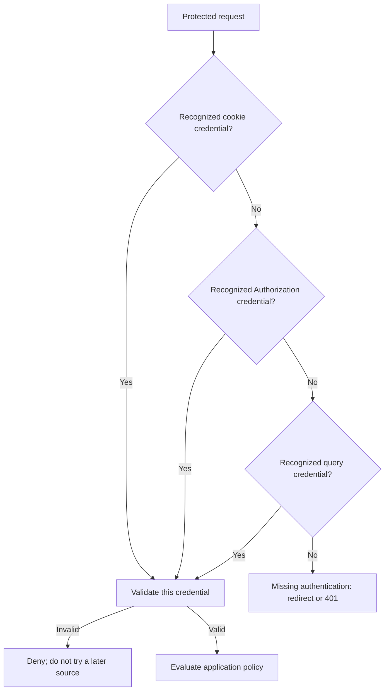

# Token Discovery

An authorization policy's default source order is **cookie → header → query**.
It selects the first discovered credential; an invalid credential from an
earlier source is not permission to try a different identity from a later one.
Keep a client's authentication source deliberate.

Configure these fragments inside the existing `authorization policy`:

```Caddyfile
# Browser applications: accept the portal cookie only.
set token sources cookie
```

```Caddyfile
# API clients: accept Authorization headers and explicit bearer syntax.
set token sources header
validate bearer header
```

```Caddyfile
# Mixed clients, with headers taking precedence.
set token sources header cookie
validate bearer header
```

`cookie`, `header`, and `query` may each occur once; their order is significant.
Bearer is a format of the header source, not a fourth source name. A policy
needs `validate bearer header` to accept `Authorization: Bearer TOKEN`; the
portal's own API validator already enables that form.




## Credential names

The default accepted access cookie names include `AUTHP_ACCESS_TOKEN`,
`access_token`, and `jwt_access_token`. Named Authorization entries and query
parameters include `access_token` and `jwt_access_token`. A named header uses
`Authorization: access_token=TOKEN`, not a header literally named access_token.

For a portal using a custom cookie prefix or name, configure the policy to match:

```Caddyfile
set access_token cookie name MYAPP_ACCESS_TOKEN
set session_id cookie name MYAPP_SESSION_ID
```

Multiple accepted access cookie names belong on one line. The session cookie
setting accepts one name. Custom access names also add lowercase names to the
named-header/query lookup. `crypto key token name` concerns keystore token
configuration; it is not a substitute for selecting the gatekeeper's accepted
cookie names.

## Exercise the intended source

```bash
curl --fail-with-body --silent --show-error \
  -H "Authorization: Bearer ${AUTHCRUNCH_ACCESS_TOKEN}" \
  https://app.example.com/private
```

For browser tests, inspect the cookie's domain, path, Secure flag, and exact
name. A cookie scoped to the portal hostname cannot authenticate a sibling
hostname unless your deployment deliberately provides compatible scope.
Avoid query tokens in new integrations: URLs can enter histories, logs, and
referrers. If a legacy client requires them, limit that source to the relevant
policy and use [token stripping](headers.md#strip-jwt-token-from-http-request).

## Agentic Prompts

Use these prompts to explore the topic with your own LLM. Open an exercise and
copy its prompt. Each one uses these primary sources, with this website as
secondary context:

- Caddy Security: [AGENTS.md](https://github.com/greenpau/caddy-security/blob/main/AGENTS.md)
  and [skills](https://github.com/greenpau/caddy-security/tree/main/.codex/skills).
- go-authcrunch: [AGENTS.md](https://github.com/greenpau/go-authcrunch/blob/main/AGENTS.md)
  and [skills](https://github.com/greenpau/go-authcrunch/tree/main/.codex/skills).

The prompts ask the LLM to read each repository's root and applicable scoped
`AGENTS.md` files, follow the relevant skills and implementation references,
and distinguish `main` from your released version. Use synthetic token values
and redacted configuration when adding your deployment details.

<div className="agentic-prompts">

<details>
<summary>1. Build a mental model of token discovery</summary>

```text
Act as my tutor for AuthCrunch token discovery.

Primary authorities (take precedence over website documentation):
https://github.com/greenpau/caddy-security/blob/main/AGENTS.md
https://github.com/greenpau/caddy-security/tree/main/.codex/skills
https://github.com/greenpau/go-authcrunch/blob/main/AGENTS.md
https://github.com/greenpau/go-authcrunch/tree/main/.codex/skills
Read each repository's root AGENTS.md before the relevant SKILL.md files.
Also read any scoped AGENTS.md files that apply to implementation paths you
inspect, and follow the skills' linked implementation references.

Secondary reference:
https://docs.authcrunch.com/docs/authorize/token-discovery

If a source is inaccessible, ask me to paste its relevant text. Identify the
versions your answer applies to; main may be newer than my release. Use the
skill-linked code and tests to resolve disagreements, and flag unverified claims.

Explain credential discovery, token validation, and authorization as three
separate decisions. Trace one browser request with a cookie and one API request
with an Authorization header. Show what each stage receives and decides, and
where a missing token, invalid signature, expired token, or missing role matters.
Use synthetic examples. Finish with three questions that test whether I can
distinguish these stages; wait for my answers before explaining them.
```

</details>

<details>
<summary>2. Predict which credential wins</summary>

```text
Help me reason about AuthCrunch token-source precedence.

Primary authorities (take precedence over website documentation):
https://github.com/greenpau/caddy-security/blob/main/AGENTS.md
https://github.com/greenpau/caddy-security/tree/main/.codex/skills
https://github.com/greenpau/go-authcrunch/blob/main/AGENTS.md
https://github.com/greenpau/go-authcrunch/tree/main/.codex/skills
Read each repository's root AGENTS.md before the relevant SKILL.md files.
Also read any scoped AGENTS.md files that apply to implementation paths you
inspect, and follow the skills' linked implementation references.

Secondary reference:
https://docs.authcrunch.com/docs/authorize/token-discovery

If a source is inaccessible, ask me to paste its relevant text. Identify the
versions your answer applies to; main may be newer than my release. Use the
skill-linked code and tests to resolve disagreements, and flag unverified claims.

Compare the default cookie-header-query order with a header-cookie policy.
Make a table for: no credentials; a valid cookie only; an invalid cookie plus
a valid header; a valid cookie plus an invalid header; and two valid credentials
belonging to different users. Add a query-token case for the default policy.
For each, identify the selected credential and what still needs validation or
authorization. Explain why an invalid earlier credential does not justify
trying a different identity later. Do not assume valid means permitted.
```

</details>

<details>
<summary>3. Understand Bearer and named Authorization headers</summary>

```text
Teach me the header formats accepted by AuthCrunch token discovery.

Primary authorities (take precedence over website documentation):
https://github.com/greenpau/caddy-security/blob/main/AGENTS.md
https://github.com/greenpau/caddy-security/tree/main/.codex/skills
https://github.com/greenpau/go-authcrunch/blob/main/AGENTS.md
https://github.com/greenpau/go-authcrunch/tree/main/.codex/skills
Read each repository's root AGENTS.md before the relevant SKILL.md files.
Also read any scoped AGENTS.md files that apply to implementation paths you
inspect, and follow the skills' linked implementation references.

Secondary reference:
https://docs.authcrunch.com/docs/authorize/token-discovery

If a source is inaccessible, ask me to paste its relevant text. Identify the
versions your answer applies to; main may be newer than my release. Use the
skill-linked code and tests to resolve disagreements, and flag unverified claims.

Compare Authorization: Bearer TOKEN, Authorization: access_token=TOKEN, and
a header literally named access_token. Explain the distinction between choosing
the header source and enabling Bearer parsing. Show the relevant policy
fragments and explain why Bearer is not a fourth token source. Distinguish an
authorization policy from the portal's own API validator. Use TOKEN as a
placeholder, and mark any parsing edge case the documentation does not resolve.
```

</details>

<details>
<summary>4. Trace custom credential names</summary>

```text
Help me understand custom token names in AuthCrunch.

Primary authorities (take precedence over website documentation):
https://github.com/greenpau/caddy-security/blob/main/AGENTS.md
https://github.com/greenpau/caddy-security/tree/main/.codex/skills
https://github.com/greenpau/go-authcrunch/blob/main/AGENTS.md
https://github.com/greenpau/go-authcrunch/tree/main/.codex/skills
Read each repository's root AGENTS.md before the relevant SKILL.md files.
Also read any scoped AGENTS.md files that apply to implementation paths you
inspect, and follow the skills' linked implementation references.

Secondary reference:
https://docs.authcrunch.com/docs/authorize/token-discovery

If a source is inaccessible, ask me to paste its relevant text. Identify the
versions your answer applies to; main may be newer than my release. Use the
skill-linked code and tests to resolve disagreements, and flag unverified claims.

Suppose my portal emits MYAPP_ACCESS_TOKEN and MYAPP_SESSION_ID cookies.
Show how the authorization policy's accepted names should match them. Explain
the difference between an access credential and the session ID, which setting
accepts multiple names, and how custom access names affect named-header and
query lookup. Contrast these settings with crypto key token name. Use a small
mapping table, and identify any session-validation behavior that requires
another reference rather than guessing from a cookie's name.
```

</details>

<details>
<summary>5. Work through browser cookie scope</summary>

```text
Explain browser cookie scope in an AuthCrunch deployment.

Primary authorities (take precedence over website documentation):
https://github.com/greenpau/caddy-security/blob/main/AGENTS.md
https://github.com/greenpau/caddy-security/tree/main/.codex/skills
https://github.com/greenpau/go-authcrunch/blob/main/AGENTS.md
https://github.com/greenpau/go-authcrunch/tree/main/.codex/skills
Read each repository's root AGENTS.md before the relevant SKILL.md files.
Also read any scoped AGENTS.md files that apply to implementation paths you
inspect, and follow the skills' linked implementation references.

Secondary reference:
https://docs.authcrunch.com/docs/authorize/token-discovery

If a source is inaccessible, ask me to paste its relevant text. Identify the
versions your answer applies to; main may be newer than my release. Use the
skill-linked code and tests to resolve disagreements, and flag unverified claims.

Compare a portal and app on one hostname with a portal at auth.example.com
and an app at app.example.com. Draw the browser-to-server request flow and
explain when Domain, Path, Secure, and the accepted cookie name affect whether
the app receives a credential. Distinguish browser delivery from AuthCrunch
discovery. Ask for my actual hostnames, portal mount, and redacted cookie
attributes before recommending a scope. Explain the trust implications of
sharing cookies across sibling hosts; keep production examples on HTTPS.
```

</details>

<details>
<summary>6. Choose token sources for my clients</summary>

```text
Help me choose an AuthCrunch token-source policy.

Primary authorities (take precedence over website documentation):
https://github.com/greenpau/caddy-security/blob/main/AGENTS.md
https://github.com/greenpau/caddy-security/tree/main/.codex/skills
https://github.com/greenpau/go-authcrunch/blob/main/AGENTS.md
https://github.com/greenpau/go-authcrunch/tree/main/.codex/skills
Read each repository's root AGENTS.md before the relevant SKILL.md files.
Also read any scoped AGENTS.md files that apply to implementation paths you
inspect, and follow the skills' linked implementation references.

Secondary reference:
https://docs.authcrunch.com/docs/authorize/token-discovery

If a source is inaccessible, ask me to paste its relevant text. Identify the
versions your answer applies to; main may be newer than my release. Use the
skill-linked code and tests to resolve disagreements, and flag unverified claims.

First ask which routes serve browsers, API clients, or both, and which Caddy
Security and go-authcrunch versions I use. Compare cookie-only, header-only,
and mixed policies for my answers. Explain credential precedence and what each
choice excludes. Show only the relevant policy fragments, including Bearer
parsing when needed, and describe an anonymous, allowed, and denied request for
each recommendation. Separate source selection from signature checks and role
rules. State assumptions instead of inventing unsupported directives.
```

</details>

<details>
<summary>7. Diagnose a request that cannot authenticate</summary>

```text
Guide me through diagnosing AuthCrunch token discovery.

Primary authorities (take precedence over website documentation):
https://github.com/greenpau/caddy-security/blob/main/AGENTS.md
https://github.com/greenpau/caddy-security/tree/main/.codex/skills
https://github.com/greenpau/go-authcrunch/blob/main/AGENTS.md
https://github.com/greenpau/go-authcrunch/tree/main/.codex/skills
Read each repository's root AGENTS.md before the relevant SKILL.md files.
Also read any scoped AGENTS.md files that apply to implementation paths you
inspect, and follow the skills' linked implementation references.

Secondary reference:
https://docs.authcrunch.com/docs/authorize/token-discovery

If a source is inaccessible, ask me to paste its relevant text. Identify the
versions your answer applies to; main may be newer than my release. Use the
skill-linked code and tests to resolve disagreements, and flag unverified claims.

My browser or curl request redirects or is rejected even though I supplied a
token. Ask for the exact status, request hostname/path, client type, software
versions, redacted policy, credential names, and cookie attributes. Do not ask
for token values or secrets. Build a decision tree separating browser delivery,
proxy forwarding, source selection, header format, token validation, and access
rules. Explain what each observation establishes and suggest one next check at
a time. Do not diagnose the cause from an HTTP status alone.
```

</details>

<details>
<summary>8. Design a source-selection test matrix</summary>

```text
Help me design tests for AuthCrunch token discovery.

Primary authorities (take precedence over website documentation):
https://github.com/greenpau/caddy-security/blob/main/AGENTS.md
https://github.com/greenpau/caddy-security/tree/main/.codex/skills
https://github.com/greenpau/go-authcrunch/blob/main/AGENTS.md
https://github.com/greenpau/go-authcrunch/tree/main/.codex/skills
Read each repository's root AGENTS.md before the relevant SKILL.md files.
Also read any scoped AGENTS.md files that apply to implementation paths you
inspect, and follow the skills' linked implementation references.

Secondary reference:
https://docs.authcrunch.com/docs/authorize/token-discovery

If a source is inaccessible, ask me to paste its relevant text. Identify the
versions your answer applies to; main may be newer than my release. Use the
skill-linked code and tests to resolve disagreements, and flag unverified claims.

Ask for my intended source order and accepted credential names. Propose 10-12
HTTP test cases covering absent, valid, invalid, and expired credentials;
conflicting identities; disabled sources; Bearer parsing; and custom names.
Use TOKEN_A and TOKEN_B as placeholders for synthetic credentials from a
disposable test environment. For each case, list the request inputs, selected
credential, expected outcome under explicit validation/role assumptions, and
the mistake it detects. Explain how to isolate source selection from unrelated
signature or role failures. Keep commands illustrative until I provide a test URL.
```

</details>

<details>
<summary>9. Replace legacy query-string tokens</summary>

```text
Help me understand how to migrate an AuthCrunch client away from query tokens.

Primary authorities (take precedence over website documentation):
https://github.com/greenpau/caddy-security/blob/main/AGENTS.md
https://github.com/greenpau/caddy-security/tree/main/.codex/skills
https://github.com/greenpau/go-authcrunch/blob/main/AGENTS.md
https://github.com/greenpau/go-authcrunch/tree/main/.codex/skills
Read each repository's root AGENTS.md before the relevant SKILL.md files.
Also read any scoped AGENTS.md files that apply to implementation paths you
inspect, and follow the skills' linked implementation references.

Secondary reference:
https://docs.authcrunch.com/docs/authorize/token-discovery
https://docs.authcrunch.com/docs/authorize/headers#strip-jwt-token-from-http-request

If a source is inaccessible, ask me to paste its relevant text. Identify the
versions your answer applies to; main may be newer than my release. Use the
skill-linked code and tests to resolve disagreements, and flag unverified claims.

Ask whether the client can send an Authorization header or use a browser cookie.
Trace where a URL token can appear before and after the authorization handler,
including browser history, logs, referrers, and the upstream app. Explain what
token stripping does and which earlier exposures it cannot undo. Propose a
staged migration, temporary policy scope, and checks that confirm the old source
can be removed. Use synthetic URLs and avoid presenting stripping as a complete
solution to credentials appearing in URLs.
```

</details>

<details>
<summary>10. Check my understanding with a guided quiz</summary>

```text
Quiz me on AuthCrunch token discovery.

Primary authorities (take precedence over website documentation):
https://github.com/greenpau/caddy-security/blob/main/AGENTS.md
https://github.com/greenpau/caddy-security/tree/main/.codex/skills
https://github.com/greenpau/go-authcrunch/blob/main/AGENTS.md
https://github.com/greenpau/go-authcrunch/tree/main/.codex/skills
Read each repository's root AGENTS.md before the relevant SKILL.md files.
Also read any scoped AGENTS.md files that apply to implementation paths you
inspect, and follow the skills' linked implementation references.

Secondary reference:
https://docs.authcrunch.com/docs/authorize/token-discovery

If a source is inaccessible, ask me to paste its relevant text. Identify the
versions your answer applies to; main may be newer than my release. Use the
skill-linked code and tests to resolve disagreements, and flag unverified claims.

Ask six scenario questions, one at a time, and wait for each answer. Cover
source order, invalid earlier credentials, Bearer versus named headers, custom
cookie names, sibling-host cookie delivery, and query-token exposure. Ask me to
explain my reasoning, not just name a directive. Correct mistakes with small
request examples and references to the relevant documentation section. At the
end, summarize what I understand, revisit weak areas, and give me one new
scenario to solve without hints. Keep undocumented behavior explicitly uncertain.
```

</details>

</div>

## Source Code References

Follow token discovery from Caddyfile options to the request handler and its
tests. These links target `main`; use GitHub's branch/tag selector to compare
the code with your installed release.

1. [Search token discovery in both repositories](https://github.com/search?q=%28repo%3Agreenpau%2Fgo-authcrunch%20OR%20repo%3Agreenpau%2Fcaddy-security%29%20language%3AGo%20%28AllowedTokenSources%20OR%20SetSourcePriority%20OR%20ValidateBearerHeader%29&type=code)
   — finds the source-order and Bearer configuration symbols across both Go codebases.
2. [caddy-security: caddyfile_authz_misc.go](https://github.com/greenpau/caddy-security/blob/main/caddyfile_authz_misc.go)
   — parses `set token sources`, cookie-name settings, and `validate bearer header`.
3. [go-authcrunch: pkg/authz/config.go](https://github.com/greenpau/go-authcrunch/blob/main/pkg/authz/config.go)
   — defines the policy fields for allowed sources, accepted cookie names, and Bearer parsing.
4. [caddy-security: caddyfile_resolve.go](https://github.com/greenpau/caddy-security/blob/main/caddyfile_resolve.go)
   — sets policy cookie-name defaults during provisioning before constructing the runtime.
5. [go-authcrunch: pkg/authz/gatekeeper.go](https://github.com/greenpau/go-authcrunch/blob/main/pkg/authz/gatekeeper.go)
   — wires policy settings into the validator, including accepted names and custom source order.
6. [go-authcrunch: pkg/authz/validator/validator.go](https://github.com/greenpau/go-authcrunch/blob/main/pkg/authz/validator/validator.go)
   — validates source names and duplicates in `SetSourcePriority`, and configures accepted credential names.
7. [go-authcrunch: pkg/authz/validator/sources.go](https://github.com/greenpau/go-authcrunch/blob/main/pkg/authz/validator/sources.go)
   — extracts cookies, Authorization entries, and query values; `Authorize` selects the first discovered credential before validating it.
8. [go-authcrunch: pkg/authz/authenticate.go](https://github.com/greenpau/go-authcrunch/blob/main/pkg/authz/authenticate.go)
   — uses `stripAuthToken` to remove the accepted credential from its request source when stripping is enabled.
9. [go-authcrunch: pkg/authz/validator/sources_test.go](https://github.com/greenpau/go-authcrunch/blob/main/pkg/authz/validator/sources_test.go)
   — exercises source precedence, custom names, disabled sources, and header parsing with test credentials.
10. [caddy-security: caddyfile_authz_test.go](https://github.com/greenpau/caddy-security/blob/main/caddyfile_authz_test.go)
    — shows Caddyfile options such as query-only discovery and Bearer parsing in adaptation tests.
