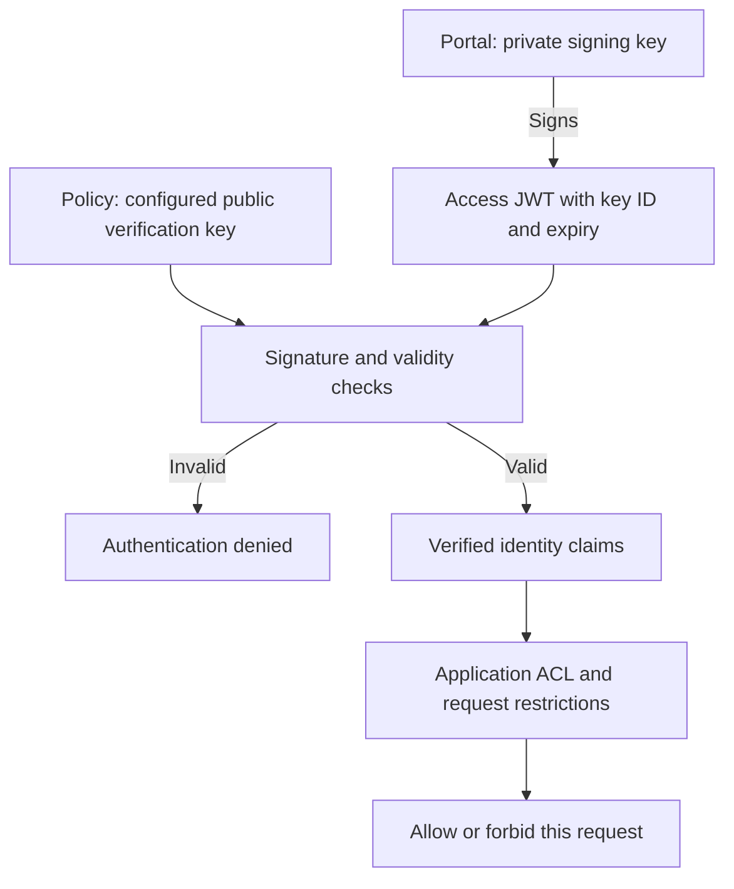

# Token Verification

The policy verifies JWTs with keys from its configured keystore. It checks
signature and time validity before access rules. Decoding a JWT payload is
not verification. Accept only keys belonging to the intended token issuer,
and constrain issuer/audience claims when multiple applications share trust.




## Verification with Shared Secret

HMAC verification supports `HS256`, `HS384`, and `HS512`. Anyone holding an HMAC
verification secret can also sign tokens, so share it only with trusted services.
Load a high-entropy private value rather than a literal copied from a guide:

```Caddyfile
# In an authorization policy; use the same secret as its portal signer.
crypto key verify from env AUTHCRUNCH_SIGNING_KEY
allow roles app/member
```

A key can have an ID:

```Caddyfile
crypto key app-signing verify from env AUTHCRUNCH_SIGNING_KEY
```

A JWT's `kid` selects the configured key; it is not a remote key URL or an
independent authority. Keep issuer keys and System encryption keys distinct.

## Verification with RSA and ECDSA Keys

Asymmetric signing lets the portal keep its private key while gatekeepers use
only a public key. A `verify` key may load a public key or derive the public
part of a private key, but distributing the private key unnecessarily also
distributes signing authority.

| JWT method | Key/signature |
| --- | --- |
| `RS256`, `RS384`, `RS512` | RSA PKCS#1 v1.5 with the corresponding SHA hash |
| `ES256` | ECDSA P-256 / SHA-256 |
| `ES384` | ECDSA P-384 / SHA-384 |
| `ES512` | ECDSA **P-521** / SHA-512 |
| `EdDSA` or supported `Ed25519` name | Ed25519 |

The key type must match the signing method. ECDSA P-521 has a 521-bit curve;
`ES512` describes its hash, not a 512-bit curve. See [JWA](https://www.rfc-editor.org/rfc/rfc7518)
and [Ed25519 in JOSE](https://www.rfc-editor.org/rfc/rfc8037) for protocol definitions.

```Caddyfile
crypto key app-signing verify from file /etc/authcrunch/signing-public.pem
```

Other supported key sources are `from directory PATH`, `from env NAME`,
`from env NAME as file`, and `from env NAME as directory`. Give the Caddy service
access to the intended files. Do not point it at a directory of unrelated keys.
The source is configuration, not automatic HTTP JWKS discovery.

### Generate RSA Public Key

Create a private directory, generate a signer, then derive its public key:

```bash
umask 077
mkdir -p "$HOME/.config/authcrunch/keys"
openssl genpkey -algorithm RSA -pkeyopt rsa_keygen_bits:3072 \
  -out "$HOME/.config/authcrunch/keys/signing-private.pem"
openssl pkey -in "$HOME/.config/authcrunch/keys/signing-private.pem" -pubout \
  -out "$HOME/.config/authcrunch/keys/signing-public.pem"
```

Configure the portal with `sign-verify from file` and the policy with
`verify from file`. Provision the files at service-readable paths; `~` in
these shell commands is not a guarantee of expansion in every configuration.

### Generate ECDSA Public Key

See [Generate an ECDSA key](encryption.md) for a complete P-256 PEM example.
Use `secp384r1` for ES384 and `secp521r1` for ES512 when generating other curves.

### Ed25519 and public JWKS

```bash
umask 077
openssl genpkey -algorithm ED25519 -out signing-ed25519-private.pem
openssl pkey -in signing-ed25519-private.pem -pubout -out signing-ed25519-public.pem
```

Released portal **`GET /auth/jwks.json`** publishes public asymmetric signing
keys, including RSA, EC, and Ed25519. HMAC and System secrets are excluded.
Its public material is appropriate for external verifiers; the
[admin private-key endpoint](../authenticate/api/40-server-api.md#private-signing-key-export)
is a separate explicit opt-in. AuthCrunch acting as an OIDC provider has its
own [dedicated OIDC signing key and JWKS](../apps/oidc-provider.md).

## Key lifecycle and scope

A verifier needs keys for tokens that remain valid during a rotation. Coordinate
old/new key overlap and reloads; a public JWKS URL alone does not configure
this Caddy policy to poll it. Automatically generated portal signing keys are
volatile unless [runtime state](../operations/runtime-state.md) persists them.

JWT access is normally bounded by token expiry. Disabling a local account,
removing a role at an external provider, or signing out of a portal does not
implement immediate distributed revocation of all already issued JWTs. Use
short appropriate lifetimes and the [refresh session](../authenticate/30-refresh-token.md)
workflow when renewable local sessions fit your application.

## Agentic Prompts

Copy a prompt into your LLM to explore this topic. Each prompt prioritizes
upstream repository guidance and code over this page, and asks for version-aware
reasoning.

<div className="agentic-prompts">

<details>
<summary>Separate decoding from trust</summary>

```text
Help me understand Token Verification.

Primary authorities (take precedence over website documentation):
https://github.com/greenpau/caddy-security/blob/main/AGENTS.md
https://github.com/greenpau/caddy-security/tree/main/.codex/skills
https://github.com/greenpau/go-authcrunch/blob/main/AGENTS.md
https://github.com/greenpau/go-authcrunch/tree/main/.codex/skills
Read each repository's root AGENTS.md first, then any scoped AGENTS.md that
applies to inspected paths. Read the relevant SKILL.md files and follow their
implementation and test references.

Relevant skills to locate: configuration-crypto, configuration-authorization.

Secondary reference:
https://docs.authcrunch.com/docs/authorize/token-verification

If a source is inaccessible, ask me to paste its relevant text. Identify the
versions your answer applies to; main may be newer than my release. Resolve
disagreements using code and tests, and flag unverified claims. Use synthetic
credentials and redacted examples; explain proposed checks before any changes.

Explain the sequence from a presented JWT to signature/time checks and then
ACL evaluation. Compare payload decoding with verification and issuer/audience
restrictions. Use synthetic claims; do not ask me to paste a real credential.
```

</details>

<details>
<summary>Compare signing-key choices</summary>

```text
Help me understand Token Verification.

Primary authorities (take precedence over website documentation):
https://github.com/greenpau/caddy-security/blob/main/AGENTS.md
https://github.com/greenpau/caddy-security/tree/main/.codex/skills
https://github.com/greenpau/go-authcrunch/blob/main/AGENTS.md
https://github.com/greenpau/go-authcrunch/tree/main/.codex/skills
Read each repository's root AGENTS.md first, then any scoped AGENTS.md that
applies to inspected paths. Read the relevant SKILL.md files and follow their
implementation and test references.

Relevant skills to locate: configuration-crypto, configuration-authorization.

Secondary reference:
https://docs.authcrunch.com/docs/authorize/token-verification

If a source is inaccessible, ask me to paste its relevant text. Identify the
versions your answer applies to; main may be newer than my release. Resolve
disagreements using code and tests, and flag unverified claims. Use synthetic
credentials and redacted examples; explain proposed checks before any changes.

Compare HMAC, RSA, ECDSA, and Ed25519 for a portal and separate verifiers.
Explain which parties can sign when holding each kind of material. Match
curves and algorithms, including ES512/P-521, and separate signing keys from
System encryption keys.
```

</details>

<details>
<summary>Diagnose verification failure</summary>

```text
Help me understand Token Verification.

Primary authorities (take precedence over website documentation):
https://github.com/greenpau/caddy-security/blob/main/AGENTS.md
https://github.com/greenpau/caddy-security/tree/main/.codex/skills
https://github.com/greenpau/go-authcrunch/blob/main/AGENTS.md
https://github.com/greenpau/go-authcrunch/tree/main/.codex/skills
Read each repository's root AGENTS.md first, then any scoped AGENTS.md that
applies to inspected paths. Read the relevant SKILL.md files and follow their
implementation and test references.

Relevant skills to locate: configuration-crypto, configuration-authorization.

Secondary reference:
https://docs.authcrunch.com/docs/authorize/token-verification

If a source is inaccessible, ask me to paste its relevant text. Identify the
versions your answer applies to; main may be newer than my release. Resolve
disagreements using code and tests, and flag unverified claims. Use synthetic
credentials and redacted examples; explain proposed checks before any changes.

Help me inspect a redacted failure using algorithm, kid, key type, key source,
clock, and service-readable paths. Ask for public metadata only. Separate a
missing configured key from a claim/ACL rejection and avoid treating kid as
authority to fetch an arbitrary URL.
```

</details>

<details>
<summary>Plan rotation without assumptions</summary>

```text
Help me understand Token Verification.

Primary authorities (take precedence over website documentation):
https://github.com/greenpau/caddy-security/blob/main/AGENTS.md
https://github.com/greenpau/caddy-security/tree/main/.codex/skills
https://github.com/greenpau/go-authcrunch/blob/main/AGENTS.md
https://github.com/greenpau/go-authcrunch/tree/main/.codex/skills
Read each repository's root AGENTS.md first, then any scoped AGENTS.md that
applies to inspected paths. Read the relevant SKILL.md files and follow their
implementation and test references.

Relevant skills to locate: configuration-crypto, configuration-authorization.

Secondary reference:
https://docs.authcrunch.com/docs/authorize/token-verification

If a source is inaccessible, ask me to paste its relevant text. Identify the
versions your answer applies to; main may be newer than my release. Resolve
disagreements using code and tests, and flag unverified claims. Use synthetic
credentials and redacted examples; explain proposed checks before any changes.

Build a key-rotation learning exercise with old/new overlap, token lifetimes,
reload behavior, and generated-key persistence. Compare public JWKS
publication with whether this policy actually polls it. State the evidence
needed for every automatic-rotation claim.
```

</details>

<details>
<summary>Test the trust boundary</summary>

```text
Help me understand Token Verification.

Primary authorities (take precedence over website documentation):
https://github.com/greenpau/caddy-security/blob/main/AGENTS.md
https://github.com/greenpau/caddy-security/tree/main/.codex/skills
https://github.com/greenpau/go-authcrunch/blob/main/AGENTS.md
https://github.com/greenpau/go-authcrunch/tree/main/.codex/skills
Read each repository's root AGENTS.md first, then any scoped AGENTS.md that
applies to inspected paths. Read the relevant SKILL.md files and follow their
implementation and test references.

Relevant skills to locate: configuration-crypto, configuration-authorization.

Secondary reference:
https://docs.authcrunch.com/docs/authorize/token-verification

If a source is inaccessible, ask me to paste its relevant text. Identify the
versions your answer applies to; main may be newer than my release. Resolve
disagreements using code and tests, and flag unverified claims. Use synthetic
credentials and redacted examples; explain proposed checks before any changes.

Design positive and negative cases for correct signature, wrong key, wrong
algorithm, expired token, untrusted issuer, and wrong audience. Show how a
verified but unauthorized identity differs from a failed verification. Tie
behavior to my installed library and adapter versions.
```

</details>

</div>

## Source Code References

Start with the code search, then follow the parser, runtime, and tests relevant
to this topic. These links target `main`; use GitHub's branch/tag selector to
compare them with your installed release.

1. [Search this topic in both repositories](https://github.com/search?q=%28repo%3Agreenpau%2Fgo-authcrunch%20OR%20repo%3Agreenpau%2Fcaddy-security%29%20%28CryptoKeyStore%20OR%20VerifyToken%20OR%20CryptoKeyConfig%29&type=code)
   — searches topic-specific symbols and paths across both codebases.
2. [caddy-security: caddyfile_authz_crypto.go](https://github.com/greenpau/caddy-security/blob/main/caddyfile_authz_crypto.go)
   — delegates policy verification-key declarations to the keystore parser.
3. [go-authcrunch: pkg/kms/crypto_keystore.go](https://github.com/greenpau/go-authcrunch/blob/main/pkg/kms/crypto_keystore.go)
   — loads and organizes configured signing, verification, and System keys.
4. [go-authcrunch: pkg/kms/crypto_key_config.go](https://github.com/greenpau/go-authcrunch/blob/main/pkg/kms/crypto_key_config.go)
   — parses individual key declarations and key-source settings.
5. [go-authcrunch: pkg/kms/methods.go](https://github.com/greenpau/go-authcrunch/blob/main/pkg/kms/methods.go)
   — maps supported signing methods and key types.
6. [go-authcrunch: pkg/kms/crypto_key_test.go](https://github.com/greenpau/go-authcrunch/blob/main/pkg/kms/crypto_key_test.go)
   — tests key construction and supported cryptographic operations.
7. [go-authcrunch: pkg/kms/jwks.go](https://github.com/greenpau/go-authcrunch/blob/main/pkg/kms/jwks.go)
   — builds public JSON Web Key Sets from appropriate signing keys.
