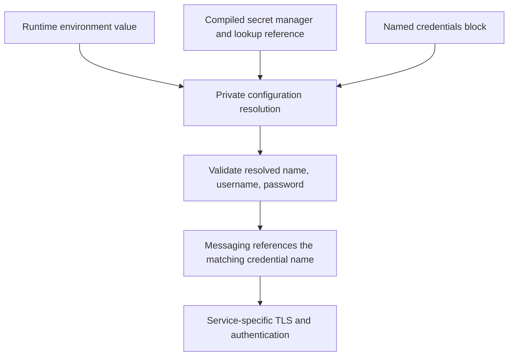

# Secrets Management

Separate service credentials, portal signing keys and user password hashes. A named `credentials` entry supplies a username/password to a consumer such as a messaging provider; it is not an encrypted vault or an end-user login account. Secret-manager references require a separately compiled module.




## Credentials Directive

Define a credential label in the global `security` block and reference that label from its consumer:

```caddyfile
credentials outbound-mail {
  username {env.SMTP_USERNAME}
  password {env.SMTP_PASSWORD}
}

messaging email provider notifications {
  address smtp.example.com:465
  protocol smtps
  credentials outbound-mail
  sender no-reply@example.com "Example portal"
}
```

The credential requires a name, nonempty username and nonempty password; `domain` is optional. The email transport uses SASL PLAIN with the username/password, not OAuth or the optional domain. Use [messaging guidance](../messaging/intro.md) for transport and workflow limits.

`{env.VARIABLE}` values here resolve during provisioning. `{$VARIABLE}` expands earlier while adapting a Caddyfile. Supply private service environment values and keep expanded configuration, process environment and credentials out of published assets. Changing an environment value does not rewrite a running provider; reprovision and test delivery. Caddy adaptation alone does not test SMTP credentials.

For local **user** passwords and API keys, use the released [credential generation commands](../authenticate/local/30-password-management.md) and [local administration CLI](../operations/local-client.md). An SMTP password must remain usable by its service; replacing it with a bcrypt hash would not authenticate to the mail server.

## Static Secrets Plugin

The optional [static secrets module](https://github.com/greenpau/caddy-security-secrets-static-secrets-manager) stores named key/value material in configuration. Its reference form is `secrets:<SECRET_ID>:<FIELD>`: the middle component identifies a configured secret and the last component is the field to retrieve, not the secret value itself.

For example, the module's `access_token` entry can supply a `shared_secret` field to:

```caddyfile
crypto key sign-verify secrets:access_token:shared_secret
```

The corresponding module block is `secrets static_secrets_manager access_token { ... }`; use the selected module version's parser for its body. Moving plaintext into that block centralizes references but does not encrypt the Caddyfile or turn static configuration into a remote vault.

This module is **not compiled into the published v1.3.0 binary audited here**. Confirm `security.secrets.static_secrets_manager` appears in `authcrunch list-modules` before using its directives. Pin and validate compatible module/integration versions for a custom build; a link to an older module README is not proof of current runtime compatibility.

## AWS Secrets Manager Secrets

The optional [AWS Secrets Manager module](https://github.com/greenpau/caddy-security-secrets-aws-secrets-manager) retrieves named secret material from **AWS Secrets Manager**, a different service from Systems Manager Parameter Store.

Its documented module configuration uses:

```caddyfile
secrets aws_secrets_manager access_token {
  region us-east-1
  path authcrunch/caddy/access_token
}
```

A consumer can then reference a field such as `secrets:access_token:value`. Match the field to the secret's actual structure. Configure the module's AWS identity/permissions privately and limit access to the intended secrets. Do not paste AWS access keys or resolved signing secrets into documentation.

`security.secrets.aws_secrets_manager` is also absent from the audited published binary. Check the module's current setup and dependencies, build it explicitly, then test retrieval and the actual consumer. Core placeholder substitution supports credential instructions and selected store/provider/key fields; it is not a promise that every arbitrary field accepts secret references or refreshes them continuously.

## Verify the boundary

Inspect the executable's modules, adapt with synthetic values, then provision in an isolated environment using the intended secret source. Check a missing credential/reference fails and the intended service operation succeeds. Record separately whether you verified grammar, secret retrieval, SMTP delivery or user login; those are different checks.

## Agentic Prompts

Copy a prompt into your LLM to explore this topic. Each prompt prioritizes
upstream repository guidance and code over this page, and asks for version-aware
reasoning.

<div className="agentic-prompts">

<details>
<summary>Classify the secret before configuring it</summary>

```text
Help me understand Credentials and secret references.

Primary authorities (take precedence over website documentation):
https://github.com/greenpau/caddy-security/blob/main/AGENTS.md
https://github.com/greenpau/caddy-security/tree/main/.codex/skills
https://github.com/greenpau/go-authcrunch/blob/main/AGENTS.md
https://github.com/greenpau/go-authcrunch/tree/main/.codex/skills
Read each repository's root AGENTS.md first, then any scoped AGENTS.md that
applies to inspected paths. Read the relevant SKILL.md files and follow their
implementation and test references.

Relevant skills to locate: configuration-credentials, configuration-secrets,
configuration-runtime-resolution.

Secondary reference:
https://docs.authcrunch.com/docs/credentials/intro

If a source is inaccessible, ask me to paste its relevant text. Identify the
versions your answer applies to; main may be newer than my release. Resolve
disagreements using code and tests, and flag unverified claims. Use synthetic
credentials and redacted examples; explain proposed checks before any changes.

Compare reusable SMTP credentials, user password hashes, account API keys,
portal signing keys, System keys, and external secret references. Explain
which component owns each and why a named credentials block is not a vault or
an LDAP bind configuration. Use only synthetic field values.
```

</details>

<details>
<summary>Trace named credentials to a consumer</summary>

```text
Help me understand Credentials and secret references.

Primary authorities (take precedence over website documentation):
https://github.com/greenpau/caddy-security/blob/main/AGENTS.md
https://github.com/greenpau/caddy-security/tree/main/.codex/skills
https://github.com/greenpau/go-authcrunch/blob/main/AGENTS.md
https://github.com/greenpau/go-authcrunch/tree/main/.codex/skills
Read each repository's root AGENTS.md first, then any scoped AGENTS.md that
applies to inspected paths. Read the relevant SKILL.md files and follow their
implementation and test references.

Relevant skills to locate: configuration-credentials, configuration-secrets,
configuration-runtime-resolution.

Secondary reference:
https://docs.authcrunch.com/docs/credentials/intro

If a source is inaccessible, ask me to paste its relevant text. Identify the
versions your answer applies to; main may be newer than my release. Resolve
disagreements using code and tests, and flag unverified claims. Use synthetic
credentials and redacted examples; explain proposed checks before any changes.

Annotate a credentials block and its messaging reference, including name
matching, required username/password, optional domain, and SASL PLAIN
consumption. Separate grammar, runtime validation, and SMTP acceptance.
Explain why changing a generic credential does not change a local user’s
password.
```

</details>

<details>
<summary>Understand when values are resolved</summary>

```text
Help me understand Credentials and secret references.

Primary authorities (take precedence over website documentation):
https://github.com/greenpau/caddy-security/blob/main/AGENTS.md
https://github.com/greenpau/caddy-security/tree/main/.codex/skills
https://github.com/greenpau/go-authcrunch/blob/main/AGENTS.md
https://github.com/greenpau/go-authcrunch/tree/main/.codex/skills
Read each repository's root AGENTS.md first, then any scoped AGENTS.md that
applies to inspected paths. Read the relevant SKILL.md files and follow their
implementation and test references.

Relevant skills to locate: configuration-credentials, configuration-secrets,
configuration-runtime-resolution.

Secondary reference:
https://docs.authcrunch.com/docs/credentials/intro

If a source is inaccessible, ask me to paste its relevant text. Identify the
versions your answer applies to; main may be newer than my release. Resolve
disagreements using code and tests, and flag unverified claims. Use synthetic
credentials and redacted examples; explain proposed checks before any changes.

Compare adaptation-time environment expansion, runtime environment
placeholders, and secrets:manager:field references. Trace the private
configuration copy and explain where expanded values could appear in adapted
JSON or diagnostics. Do not assume every setting accepts references or that
values refresh continuously after startup.
```

</details>

<details>
<summary>Check external secret-manager availability</summary>

```text
Help me understand Credentials and secret references.

Primary authorities (take precedence over website documentation):
https://github.com/greenpau/caddy-security/blob/main/AGENTS.md
https://github.com/greenpau/caddy-security/tree/main/.codex/skills
https://github.com/greenpau/go-authcrunch/blob/main/AGENTS.md
https://github.com/greenpau/go-authcrunch/tree/main/.codex/skills
Read each repository's root AGENTS.md first, then any scoped AGENTS.md that
applies to inspected paths. Read the relevant SKILL.md files and follow their
implementation and test references.

Relevant skills to locate: configuration-credentials, configuration-secrets,
configuration-runtime-resolution.

Secondary reference:
https://docs.authcrunch.com/docs/credentials/intro

If a source is inaccessible, ask me to paste its relevant text. Identify the
versions your answer applies to; main may be newer than my release. Resolve
disagreements using code and tests, and flag unverified claims. Use synthetic
credentials and redacted examples; explain proposed checks before any changes.

Given a proposed AWS secret integration, inspect my compiled modules and
installed versions before choosing a plugin. Distinguish Secrets Manager from
Parameter Store and the secret lookup from the consuming credential object.
Plan missing-manager, missing-field, denied retrieval, and invalid
resolved-value checks with disposable examples.
```

</details>

<details>
<summary>Diagnose a service authentication failure</summary>

```text
Help me understand Credentials and secret references.

Primary authorities (take precedence over website documentation):
https://github.com/greenpau/caddy-security/blob/main/AGENTS.md
https://github.com/greenpau/caddy-security/tree/main/.codex/skills
https://github.com/greenpau/go-authcrunch/blob/main/AGENTS.md
https://github.com/greenpau/go-authcrunch/tree/main/.codex/skills
Read each repository's root AGENTS.md first, then any scoped AGENTS.md that
applies to inspected paths. Read the relevant SKILL.md files and follow their
implementation and test references.

Relevant skills to locate: configuration-credentials, configuration-secrets,
configuration-runtime-resolution.

Secondary reference:
https://docs.authcrunch.com/docs/credentials/intro

If a source is inaccessible, ask me to paste its relevant text. Identify the
versions your answer applies to; main may be newer than my release. Resolve
disagreements using code and tests, and flag unverified claims. Use synthetic
credentials and redacted examples; explain proposed checks before any changes.

Build a staged diagnosis for an SMTP login failure: name resolution, absent or
malformed secret, provisioning, network/TLS, mechanism support, and server
rejection. Ask for redacted statuses and module evidence. Keep retrieval
success separate from service acceptance and avoid printing credentials as a
debugging technique.
```

</details>

</div>

## Source Code References

Start with the code search, then follow the parser, runtime, and tests relevant
to this topic. These links target `main`; use GitHub's branch/tag selector to
compare them with your installed release.

1. [Search this topic in both repositories](https://github.com/search?q=%28repo%3Agreenpau%2Fgo-authcrunch%20OR%20repo%3Agreenpau%2Fcaddy-security%29%20%28GenericCredential%20OR%20ResolveRuntimeAppConfig%20OR%20security.secrets%29&type=code)
   — searches topic-specific symbols and paths across both codebases.
2. [caddy-security: caddyfile_credentials.go](https://github.com/greenpau/caddy-security/blob/main/caddyfile_credentials.go)
   — adapts reusable named username/password credential declarations.
3. [caddy-security: caddyfile_credentials_test.go](https://github.com/greenpau/caddy-security/blob/main/caddyfile_credentials_test.go)
   — tests credential block grammar and adapted fields.
4. [caddy-security: caddyfile_secrets.go](https://github.com/greenpau/caddy-security/blob/main/caddyfile_secrets.go)
   — adapts separately compiled external secret-manager declarations.
5. [caddy-security: caddyfile_resolve.go](https://github.com/greenpau/caddy-security/blob/main/caddyfile_resolve.go)
   — resolves runtime environment and secret references in private configuration copies.
6. [go-authcrunch: pkg/credentials/generic_credential.go](https://github.com/greenpau/go-authcrunch/blob/main/pkg/credentials/generic_credential.go)
   — validates reusable credential names, usernames, passwords, and optional domains.
7. [go-authcrunch: pkg/messaging/email_send.go](https://github.com/greenpau/go-authcrunch/blob/main/pkg/messaging/email_send.go)
   — sends SMTP/SMTPS messages and constructs headers and envelope recipients.
