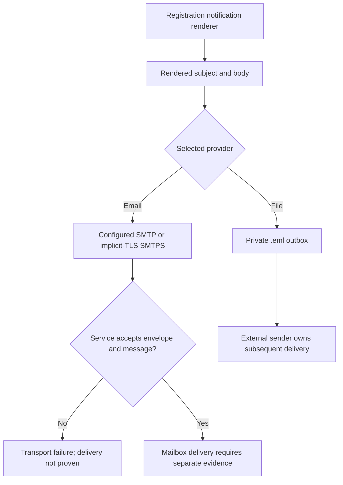

# Messaging Providers

Messaging providers deliver account-registration notifications. Define a provider in `security`, then attach it to a [local registration](../authenticate/local/40-user-registration.md) through `email provider <name>`. That registration setting can select an email **or file** provider.

The released workflow sends a registrant's confirmation and attempts an administrator notification after the verified request is stored in the dropbox. This does not implement account approval, automatic active-store provisioning, password-reset emails or email-based MFA. See [challenge support](../authenticate/13-authentication-challenges.md) before enabling a factor.




## Email Messaging Provider

The email provider supports `smtp` and `smtps`. Authentication uses SASL PLAIN with a named username/password credential. The release does not implement STARTTLS upgrade or OAuth mail authentication.

### Configuration

Use implicit TLS on the mail service's configured SMTPS endpoint:

```caddyfile
credentials outbound-mail {
  username {env.SMTP_USERNAME}
  password {env.SMTP_PASSWORD}
}

messaging email provider notifications {
  address smtp.example.com:465
  protocol smtps
  credentials outbound-mail
  sender no-reply@example.com "Example portal"
}
```

Put both blocks in `security`. The address includes the port; the server certificate must validate for its hostname. Attach `email provider notifications` to the registration registry. A successful syntax check does not prove network reachability or mail delivery.

`bcc` accepts addresses, but the released email implementation writes a Bcc header without issuing extra SMTP RCPT commands. Do not rely on it for copies, delivery or recipient privacy. Administrator registration messages use the registry's explicit `admin email` recipients instead.

#### Testing with Mock Email Server

Use a disposable mail sink bound to loopback only. For example, the [go-smtp debug server](https://github.com/emersion/go-smtp/tree/master/cmd/smtp-debug-server) can receive test mail; choose a pinned version if installing a tool. The [registration example](https://github.com/authcrunch/authcrunch.github.io/blob/main/assets/conf/local/registration/Caddyfile) targets `127.0.0.1:1025` with `protocol smtp` and `passwordless`.

Run a fresh test portal and sink, submit a synthetic account, inspect the confirmation, enter the new emailed code and check the dropbox and administrator message. Test a wrong code and failed delivery. Keep test messages private because their links and passcodes authorize the pending confirmation. Stop both servers afterward.

#### SMTP Server Message

A confirmation includes the registrant's address, an acknowledgement URL under `/auth/register/<realm>/ack/<id>` and a generated passcode. Treat SMTP acceptance as delivery to the sink, not proof a production mailbox received it. The pending registration remains inactive until your separate approval/provisioning process.

If sending the initial confirmation fails, the portal removes pending cache state and shows an error. If notifying an administrator fails **after** acknowledgement, the committed dropbox request remains and the error is logged. Review the dropbox independently of notification delivery.

### Passwordless

`passwordless` means the **SMTP connection** does not authenticate. It does not remove end-user password requirements or turn email into a login factor.

```caddyfile
messaging email provider local-sink {
  address 127.0.0.1:1025
  protocol smtp
  passwordless
  sender no-reply@example.com "Disposable test portal"
}
```

Use either `credentials` or `passwordless`, never both. Plain `smtp` does not encrypt the connection in this release; reserve the example above for a controlled loopback sink.

### TLS

`protocol smtps` opens TLS immediately and validates the server certificate using the system trust roots. It is not STARTTLS on a plaintext SMTP connection. A server that only offers STARTTLS requires a compatible external relay/transport arrangement; changing the port number alone does not implement an upgrade.

## File Messaging Provider

A file provider writes private `.eml` messages for local inspection or an external spool consumer. AuthCrunch does not run that mailer or deliver the files to a remote mailbox.

### Configuration

```caddyfile
messaging file provider private-spool {
  root_dir /var/lib/authcrunch/mail
  sender no-reply@example.com "Example portal"
}
```

Select `email provider private-spool` in the registry. The release creates a missing directory with mode `0700` and message files with mode `0600`. Pre-existing directory permissions remain the operator's responsibility. Keep the directory outside web roots, backups with broad readership and published site assets; remove expired test mail through your own retention process.

#### Email Message

Each message contains subject, recipient and encoded HTML content. The file implementation does not emit the configured From/Bcc headers. An external spool consumer must account for this rather than assuming a complete SMTP envelope is encoded in the file. Check the newly created file instead of copying the historical examples' links or passcodes.

## Messaging Templates

The provider parsers recognize these names:

| Name | Released workflow boundary |
| --- | --- |
| `registration_confirmation` | Used by registration submission |
| `registration_ready` | Used for attempted administrator notification after acknowledgement |
| `registration_verdict` | Supported by the library notification method; no complete portal approval workflow invokes it |
| `password_recovery` | Accepted configuration name; not a completed mail-based password recovery workflow |
| `mfa_otp` | Accepted configuration name; not a supported email MFA challenge |

The syntax `template <name> <path>` is accepted, but the released registration notification method renders **embedded English templates** and does not read the provider's configured template paths. A custom file, accepted configuration or visible reset/approval wording is therefore not evidence that the workflow or override runs.

Embedded registration bodies use context-aware HTML escaping and quoted-printable delivery. Keep confirmation credentials private. To change this behavior, verify a future implementation and its consuming workflow before treating template settings as effective customization.

## Agentic Prompts

Copy a prompt into your LLM to explore this topic. Each prompt prioritizes
upstream repository guidance and code over this page, and asks for version-aware
reasoning.

<div className="agentic-prompts">

<details>
<summary>Map a registration notification</summary>

```text
Help me understand Messaging providers.

Primary authorities (take precedence over website documentation):
https://github.com/greenpau/caddy-security/blob/main/AGENTS.md
https://github.com/greenpau/caddy-security/tree/main/.codex/skills
https://github.com/greenpau/go-authcrunch/blob/main/AGENTS.md
https://github.com/greenpau/go-authcrunch/tree/main/.codex/skills
Read each repository's root AGENTS.md first, then any scoped AGENTS.md that
applies to inspected paths. Read the relevant SKILL.md files and follow their
implementation and test references.

Relevant skills to locate: configuration-messaging, configuration-credentials,
local-password-authentication.

Secondary reference:
https://docs.authcrunch.com/docs/messaging/intro

If a source is inaccessible, ask me to paste its relevant text. Identify the
versions your answer applies to; main may be newer than my release. Resolve
disagreements using code and tests, and flag unverified claims. Use synthetic
credentials and redacted examples; explain proposed checks before any changes.

Trace a registration request, confirmation message, acknowledgment,
administrative notification, and pending-account dropbox. Explain how the
named provider is selected and which failures clean up or retain state.
Distinguish SMTP acceptance, inbox delivery, email confirmation, and account
approval.
```

</details>

<details>
<summary>Choose the actual transport</summary>

```text
Help me understand Messaging providers.

Primary authorities (take precedence over website documentation):
https://github.com/greenpau/caddy-security/blob/main/AGENTS.md
https://github.com/greenpau/caddy-security/tree/main/.codex/skills
https://github.com/greenpau/go-authcrunch/blob/main/AGENTS.md
https://github.com/greenpau/go-authcrunch/tree/main/.codex/skills
Read each repository's root AGENTS.md first, then any scoped AGENTS.md that
applies to inspected paths. Read the relevant SKILL.md files and follow their
implementation and test references.

Relevant skills to locate: configuration-messaging, configuration-credentials,
local-password-authentication.

Secondary reference:
https://docs.authcrunch.com/docs/messaging/intro

If a source is inaccessible, ask me to paste its relevant text. Identify the
versions your answer applies to; main may be newer than my release. Resolve
disagreements using code and tests, and flag unverified claims. Use synthetic
credentials and redacted examples; explain proposed checks before any changes.

Compare plaintext SMTP, implicit-TLS SMTPS, and a private file outbox. Explain
SASL PLAIN, passwordless SMTP, and the lack of STARTTLS/OAuth support in my
version. Ask for server transport requirements before proposing an address or
port; do not equate passwordless delivery with passwordless user login.
```

</details>

<details>
<summary>Inspect recipients and privacy</summary>

```text
Help me understand Messaging providers.

Primary authorities (take precedence over website documentation):
https://github.com/greenpau/caddy-security/blob/main/AGENTS.md
https://github.com/greenpau/caddy-security/tree/main/.codex/skills
https://github.com/greenpau/go-authcrunch/blob/main/AGENTS.md
https://github.com/greenpau/go-authcrunch/tree/main/.codex/skills
Read each repository's root AGENTS.md first, then any scoped AGENTS.md that
applies to inspected paths. Read the relevant SKILL.md files and follow their
implementation and test references.

Relevant skills to locate: configuration-messaging, configuration-credentials,
local-password-authentication.

Secondary reference:
https://docs.authcrunch.com/docs/messaging/intro

If a source is inaccessible, ask me to paste its relevant text. Identify the
versions your answer applies to; main may be newer than my release. Resolve
disagreements using code and tests, and flag unverified claims. Use synthetic
credentials and redacted examples; explain proposed checks before any changes.

Compare message headers with SMTP envelope recipients using synthetic
addresses. Inspect the implementation of Bcc and file-provider output instead
of assuming extra delivery or hidden recipients. Explain how to notify
administrators explicitly and what an external outbox sender must validate.
```

</details>

<details>
<summary>Separate accepted templates from working flows</summary>

```text
Help me understand Messaging providers.

Primary authorities (take precedence over website documentation):
https://github.com/greenpau/caddy-security/blob/main/AGENTS.md
https://github.com/greenpau/caddy-security/tree/main/.codex/skills
https://github.com/greenpau/go-authcrunch/blob/main/AGENTS.md
https://github.com/greenpau/go-authcrunch/tree/main/.codex/skills
Read each repository's root AGENTS.md first, then any scoped AGENTS.md that
applies to inspected paths. Read the relevant SKILL.md files and follow their
implementation and test references.

Relevant skills to locate: configuration-messaging, configuration-credentials,
local-password-authentication.

Secondary reference:
https://docs.authcrunch.com/docs/messaging/intro

If a source is inaccessible, ask me to paste its relevant text. Identify the
versions your answer applies to; main may be newer than my release. Resolve
disagreements using code and tests, and flag unverified claims. Use synthetic
credentials and redacted examples; explain proposed checks before any changes.

Trace a configured template path and the registration renderer’s embedded
templates. Explain which validated template names have actual consumers and
why accepted settings do not prove recovery, MFA delivery, or approval is
implemented. Identify release-specific evidence before proposing custom
template behavior.
```

</details>

<details>
<summary>Design a disposable delivery check</summary>

```text
Help me understand Messaging providers.

Primary authorities (take precedence over website documentation):
https://github.com/greenpau/caddy-security/blob/main/AGENTS.md
https://github.com/greenpau/caddy-security/tree/main/.codex/skills
https://github.com/greenpau/go-authcrunch/blob/main/AGENTS.md
https://github.com/greenpau/go-authcrunch/tree/main/.codex/skills
Read each repository's root AGENTS.md first, then any scoped AGENTS.md that
applies to inspected paths. Read the relevant SKILL.md files and follow their
implementation and test references.

Relevant skills to locate: configuration-messaging, configuration-credentials,
local-password-authentication.

Secondary reference:
https://docs.authcrunch.com/docs/messaging/intro

If a source is inaccessible, ask me to paste its relevant text. Identify the
versions your answer applies to; main may be newer than my release. Resolve
disagreements using code and tests, and flag unverified claims. Use synthetic
credentials and redacted examples; explain proposed checks before any changes.

Plan a private file-outbox check for rendered content, then a separate
loopback SMTP check for TLS/authentication and envelope behavior when needed.
Use synthetic identities and bounded output. Explain what each check proves,
stop any temporary sender/server afterward, and avoid treating it as proof of
real mailbox delivery.
```

</details>

</div>

## Source Code References

Start with the code search, then follow the parser, runtime, and tests relevant
to this topic. These links target `main`; use GitHub's branch/tag selector to
compare them with your installed release.

1. [Search this topic in both repositories](https://github.com/search?q=%28repo%3Agreenpau%2Fgo-authcrunch%20OR%20repo%3Agreenpau%2Fcaddy-security%29%20%28EmailProvider%20OR%20FileProvider%20OR%20dedupRcpt%29&type=code)
   — searches topic-specific symbols and paths across both codebases.
2. [caddy-security: caddyfile_messaging.go](https://github.com/greenpau/caddy-security/blob/main/caddyfile_messaging.go)
   — adapts email/file providers and delegates their settings to the library.
3. [caddy-security: caddyfile_messaging_test.go](https://github.com/greenpau/caddy-security/blob/main/caddyfile_messaging_test.go)
   — tests messaging-provider adaptation and rejected declarations.
4. [go-authcrunch: pkg/messaging/email_send.go](https://github.com/greenpau/go-authcrunch/blob/main/pkg/messaging/email_send.go)
   — sends SMTP/SMTPS messages and constructs headers and envelope recipients.
5. [go-authcrunch: pkg/messaging/file_send.go](https://github.com/greenpau/go-authcrunch/blob/main/pkg/messaging/file_send.go)
   — writes rendered messages to a private file-provider outbox.
6. [go-authcrunch: pkg/messaging/email_template.go](https://github.com/greenpau/go-authcrunch/blob/main/pkg/messaging/email_template.go)
   — loads the embedded messaging template library.
7. [go-authcrunch: pkg/registry/local_user_registry.go](https://github.com/greenpau/go-authcrunch/blob/main/pkg/registry/local_user_registry.go)
   — collects and verifies registration requests into a separate local dropbox.
