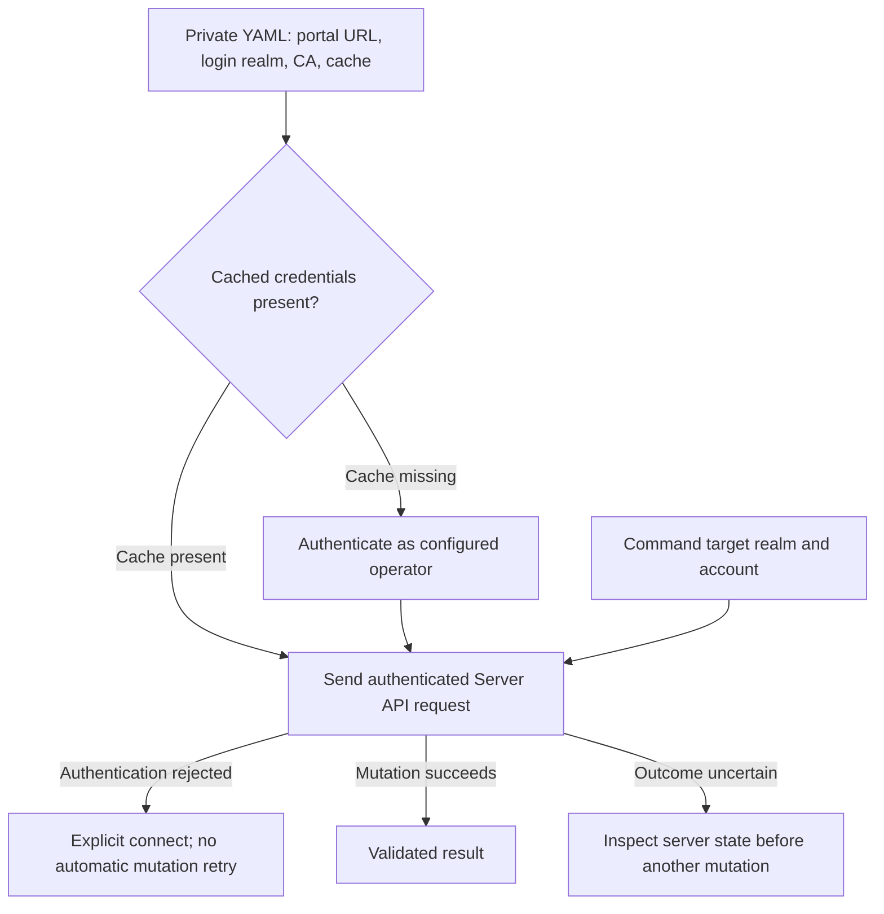

# Local management CLI

The released `authcrunch` executable includes **`security local`**. It calls a
running portal's [Server API](../authenticate/api/40-server-api.md); it does not
edit database files directly. Credential generators work offline and do not
require a server or administrator session.

```bash
authcrunch security local --help
authcrunch security local generate --help
```

Use the actual executable path from your installation. This guide targets
[Caddy Security v1.3.0 / library v1.3.8](versions.md). The standalone pinned
`authdbctl` client is another management interface, but its command-line flags
and retry behavior differ; do not interchange command examples blindly.

## Prepare administrator access

Enable `enable admin api` inside the portal and use a trusted account with
`authp/admin`. The client configuration is a separate private YAML file,
**not the server's Caddyfile**:

```yaml
base_url: https://auth.example.com/auth
realm: local
username: webadmin
token_path: credentials.json
```

`realm` identifies the administrator's login store. A command's `--realm`
identifies the store being managed; these can differ. `base_url` includes the
portal mount and has no query or fragment. A relative `token_path` is resolved
beside the client configuration. Without an explicit path, the bundled CLI
isolates caches by portal and login identity under `.security-tokens`.

Create the parent directory privately and save the YAML with owner-only
permissions, such as `0700` for the directory and `0600` for the file. On Unix,
the CLI rejects credential files readable by group/others. Config and existing
token inputs must be regular files, not leaf symlinks. Keep a separate token
file for each portal and identity; never choose the configuration file or CA
file as the token output.

Omit `password` to use the hidden terminal prompt. A private configuration can
supply `password` or supported TOTP settings for automation, but it then holds
those secrets. The YAML loader does not expand Caddyfile environment placeholders.
WebAuthn/U2F interactive challenges are not supported by this client.




## Connect and inspect

```bash
authcrunch security local connect --config "$HOME/.config/authcrunch/admin.yaml"
authcrunch security local metadata --config "$HOME/.config/authcrunch/admin.yaml"
authcrunch security local list realms --config "$HOME/.config/authcrunch/admin.yaml"
authcrunch security local list users \
  --config "$HOME/.config/authcrunch/admin.yaml" --realm local --format table
authcrunch security local info realm \
  --config "$HOME/.config/authcrunch/admin.yaml" --realm local
```

`connect` authenticates and saves private credentials. A command can authenticate
when its token file is missing. Existing invalid or expired credentials require
an explicit `connect`; administrative requests are not automatically retried.
For a private/internal CA, add `--ca-file /path/to/ca.pem` rather than disabling
TLS verification. `--timeout` bounds login and the request.

Lists support `json`, `table`, and `csv`. Account details can include hashes or
other private data; they are not a public reporting endpoint.

If the portal enables refresh sessions for the administrator's realm, its
browser transport returns metadata rather than a JSON access credential. Add
`refresh_transport: body` to the client YAML **and** explicitly enable native
body transport in that realm's [refresh configuration](../authenticate/30-refresh-token.md).
The CLI stores returned credentials but does not automatically rotate a refresh
family to renew administrative requests. An API-key login is access-only and
cannot select body refresh transport.

## Manage one account

User commands require both username and email. Creation returns a generated
password; keep the output private and arrange delivery through your approved
account-provisioning process.

```bash
authcrunch security local add user \
  --config "$HOME/.config/authcrunch/admin.yaml" --realm local \
  --username alice --email alice@example.com --name 'Alice Example' \
  --roles authp/user,app/member

authcrunch security local info user \
  --config "$HOME/.config/authcrunch/admin.yaml" --realm local \
  --username alice --email alice@example.com
```

Supported updates are account enable/disable, password reset, role replacement
or addition, and ordered authentication-challenge replacement. For example:

```bash
authcrunch security local update user \
  --config "$HOME/.config/authcrunch/admin.yaml" --realm local \
  --username alice --email alice@example.com --overwrite-roles authp/user,report/reader
```

Use `update user --help` for the mutually applicable flags. Password reset
prints a new credential. Role changes must agree with your application's policy.
Changing an account is not immediate distributed revocation of already issued
JWTs or every cached credential result.

`delete user` removes the selected account; `reload --realm local` reloads a
store from disk, not the server configuration. Take an appropriate backup and
verify the exact target before these operations. If a sent mutation encounters
a transport error, the server may already have committed it. Inspect the account
before repeating; the CLI reports an uncertain outcome and does not retry.

## Generate credentials offline

```bash
authcrunch security local generate password hash --algorithm bcrypt
authcrunch security local generate password hash --algorithm argon2
authcrunch security local generate api key
```

The password commands support hidden input and private file/stdin input; see
[password imports](../authenticate/local/30-password-management.md). The API-key
command emits a private 72-character secret and an `api key PREFIX HASH`
directive. Keep the secret for the caller and provision the directive to the
intended static local user. Neither generator writes an account or authenticates
a request by itself.

For application code that needs portal login without administrative commands,
use the [Go authentication client](authclient.md).

## Agentic Prompts

Copy a prompt into your LLM to explore this topic. Each prompt prioritizes
upstream repository guidance and code over this page, and asks for version-aware
reasoning.

<div className="agentic-prompts">

<details>
<summary>Choose the right management tool</summary>

```text
Help me understand Local management CLI.

Primary authorities (take precedence over website documentation):
https://github.com/greenpau/caddy-security/blob/main/AGENTS.md
https://github.com/greenpau/caddy-security/tree/main/.codex/skills
https://github.com/greenpau/go-authcrunch/blob/main/AGENTS.md
https://github.com/greenpau/go-authcrunch/tree/main/.codex/skills
Read each repository's root AGENTS.md first, then any scoped AGENTS.md that
applies to inspected paths. Read the relevant SKILL.md files and follow their
implementation and test references.

Relevant skills to locate: authentication-portal-api, authentication-client,
authdbctl.

Secondary reference:
https://docs.authcrunch.com/docs/operations/local-client

If a source is inaccessible, ask me to paste its relevant text. Identify the
versions your answer applies to; main may be newer than my release. Resolve
disagreements using code and tests, and flag unverified claims. Use synthetic
credentials and redacted examples; explain proposed checks before any changes.

Compare bundled security local commands, the separate authdbctl utility,
direct Server API calls, and offline password/API-key generation. Explain
which operations contact a portal and which mutate accounts. Do not transfer
flags or retry behavior between tools; ask for the actual executable and its
help output.
```

</details>

<details>
<summary>Read the client configuration</summary>

```text
Help me understand Local management CLI.

Primary authorities (take precedence over website documentation):
https://github.com/greenpau/caddy-security/blob/main/AGENTS.md
https://github.com/greenpau/caddy-security/tree/main/.codex/skills
https://github.com/greenpau/go-authcrunch/blob/main/AGENTS.md
https://github.com/greenpau/go-authcrunch/tree/main/.codex/skills
Read each repository's root AGENTS.md first, then any scoped AGENTS.md that
applies to inspected paths. Read the relevant SKILL.md files and follow their
implementation and test references.

Relevant skills to locate: authentication-portal-api, authentication-client,
authdbctl.

Secondary reference:
https://docs.authcrunch.com/docs/operations/local-client

If a source is inaccessible, ask me to paste its relevant text. Identify the
versions your answer applies to; main may be newer than my release. Resolve
disagreements using code and tests, and flag unverified claims. Use synthetic
credentials and redacted examples; explain proposed checks before any changes.

Annotate a redacted private YAML file for base_url including the portal mount,
authentication realm, target --realm, CA file, timeout, and token path.
Explain relative token paths and why Caddy placeholders are not expanded in
client YAML. Distinguish an admin’s login identity from the store being
administered.
```

</details>

<details>
<summary>Diagnose authentication and token caching</summary>

```text
Help me understand Local management CLI.

Primary authorities (take precedence over website documentation):
https://github.com/greenpau/caddy-security/blob/main/AGENTS.md
https://github.com/greenpau/caddy-security/tree/main/.codex/skills
https://github.com/greenpau/go-authcrunch/blob/main/AGENTS.md
https://github.com/greenpau/go-authcrunch/tree/main/.codex/skills
Read each repository's root AGENTS.md first, then any scoped AGENTS.md that
applies to inspected paths. Read the relevant SKILL.md files and follow their
implementation and test references.

Relevant skills to locate: authentication-portal-api, authentication-client,
authdbctl.

Secondary reference:
https://docs.authcrunch.com/docs/operations/local-client

If a source is inaccessible, ask me to paste its relevant text. Identify the
versions your answer applies to; main may be newer than my release. Resolve
disagreements using code and tests, and flag unverified claims. Use synthetic
credentials and redacted examples; explain proposed checks before any changes.

Compare missing, invalid, and expired cached credentials with an explicit
connect operation. Explain password prompting, TOTP requirements, access-only
API keys, and explicit body refresh transport. Check whether the CLI rotates
refresh credentials before assuming unattended sessions remain usable.
```

</details>

<details>
<summary>Handle an uncertain mutation</summary>

```text
Help me understand Local management CLI.

Primary authorities (take precedence over website documentation):
https://github.com/greenpau/caddy-security/blob/main/AGENTS.md
https://github.com/greenpau/caddy-security/tree/main/.codex/skills
https://github.com/greenpau/go-authcrunch/blob/main/AGENTS.md
https://github.com/greenpau/go-authcrunch/tree/main/.codex/skills
Read each repository's root AGENTS.md first, then any scoped AGENTS.md that
applies to inspected paths. Read the relevant SKILL.md files and follow their
implementation and test references.

Relevant skills to locate: authentication-portal-api, authentication-client,
authdbctl.

Secondary reference:
https://docs.authcrunch.com/docs/operations/local-client

If a source is inaccessible, ask me to paste its relevant text. Identify the
versions your answer applies to; main may be newer than my release. Resolve
disagreements using code and tests, and flag unverified claims. Use synthetic
credentials and redacted examples; explain proposed checks before any changes.

Walk through create, reset-password, role update, challenge update, account
disable, and store reload requests. Explain generated-password output and why
a timeout can follow a committed mutation. Plan an inspect-before-retry
workflow rather than automatically replaying writes; distinguish store reload
from Caddy reload.
```

</details>

<details>
<summary>Review private files and observable failures</summary>

```text
Help me understand Local management CLI.

Primary authorities (take precedence over website documentation):
https://github.com/greenpau/caddy-security/blob/main/AGENTS.md
https://github.com/greenpau/caddy-security/tree/main/.codex/skills
https://github.com/greenpau/go-authcrunch/blob/main/AGENTS.md
https://github.com/greenpau/go-authcrunch/tree/main/.codex/skills
Read each repository's root AGENTS.md first, then any scoped AGENTS.md that
applies to inspected paths. Read the relevant SKILL.md files and follow their
implementation and test references.

Relevant skills to locate: authentication-portal-api, authentication-client,
authdbctl.

Secondary reference:
https://docs.authcrunch.com/docs/operations/local-client

If a source is inaccessible, ask me to paste its relevant text. Identify the
versions your answer applies to; main may be newer than my release. Resolve
disagreements using code and tests, and flag unverified claims. Use synthetic
credentials and redacted examples; explain proposed checks before any changes.

Design tests for owner-only config/cache/output, leaf symlink rejection,
output colliding with input or CA files, untrusted TLS, denied admin role, and
disabled Server API. Use disposable paths and synthetic identities. Separate
local file checks from server authentication, authorization, and account
changes.
```

</details>

</div>

## Source Code References

Start with the code search, then follow the parser, runtime, and tests relevant
to this topic. These links target `main`; use GitHub's branch/tag selector to
compare them with your installed release.

1. [Search this topic in both repositories](https://github.com/search?q=%28repo%3Agreenpau%2Fgo-authcrunch%20OR%20repo%3Agreenpau%2Fcaddy-security%29%20%28securityLocalClient%20OR%20runSecurityLocal%20OR%20securityLocalPayload%29&type=code)
   — searches topic-specific symbols and paths across both codebases.
2. [caddy-security: command_local.go](https://github.com/greenpau/caddy-security/blob/main/command_local.go)
   — defines bundled local-management commands and their Server API request payloads.
3. [caddy-security: command_local_client.go](https://github.com/greenpau/caddy-security/blob/main/command_local_client.go)
   — loads private client configuration, authenticates, and sends bounded administrative requests.
4. [caddy-security: command_local_output.go](https://github.com/greenpau/caddy-security/blob/main/command_local_output.go)
   — formats management results and handles private output files.
5. [caddy-security: command_local_safety_test.go](https://github.com/greenpau/caddy-security/blob/main/command_local_safety_test.go)
   — tests private-file handling and local-command safety boundaries.
6. [caddy-security: command_local_e2e_test.go](https://github.com/greenpau/caddy-security/blob/main/command_local_e2e_test.go)
   — exercises the bundled client against a portal and local administration API.
7. [go-authcrunch: pkg/authclient/client.go](https://github.com/greenpau/go-authcrunch/blob/main/pkg/authclient/client.go)
   — runs context-bound JSON authentication and checkpoint continuation.
8. [go-authcrunch: pkg/authn/handle_api_crud_user.go](https://github.com/greenpau/go-authcrunch/blob/main/pkg/authn/handle_api_crud_user.go)
   — validates administrative account targets and requested mutations.
9. [caddy-security: command_credentials.go](https://github.com/greenpau/caddy-security/blob/main/command_credentials.go)
   — implements offline password-hash and API-key generation.
