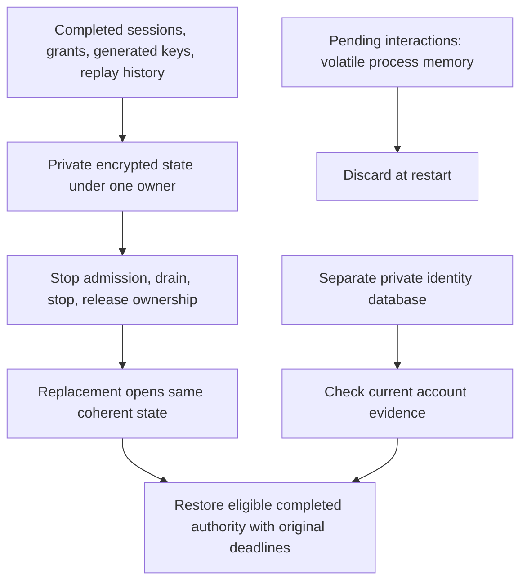

# Persistent runtime state

AuthCrunch normally keeps runtime sessions in memory. The optional `state`
block saves completed sessions and generated keys so an unchanged installation
can restart without asking every user to sign in again. This is available in
**caddy-security v1.3.0 / go-authcrunch v1.3.8**.

## Enable storage

Add this block inside your existing global `security` block:

```caddyfile
state {
    directory /var/lib/authcrunch/runtime
}
```

Choose a stable absolute directory outside temporary or release directories.
The service creates missing storage privately; an existing directory must have
owner-only permissions. The runtime uses 0700 directories and 0600 files.
Ensure the service account can create and maintain them. An empty block, root
directory, or invalid path is an error, not a request to fall back to memory.

**Use a local Unix filesystem and one active process per directory.** Network
filesystems, sharing between active replicas, and Windows persistence are not
supported. File-backed local user databases remain separate from runtime state;
an in-memory local database is incompatible with persistence.




## What survives a restart

| State | Retained with the same storage and compatible configuration |
| --- | --- |
| Generated signing keys | Existing generated key material and verification of unexpired tokens |
| Completed portal logins | Unexpired sessions and their original local authentication evidence |
| [Portal refresh](../authenticate/30-refresh-token.md) | Families, deadlines, rotations and complete replay history |
| [Direct OAuth authorization](../authorize/direct-oauth.md) | Completed sessions and successful local logout |
| [OIDC provider](../apps/oidc-provider.md) | Completed browser sessions, consent, code/token grants and replay history |

Pending logins, sandbox checkpoints, MFA enrollment, registration and unfinished
interactive authorization must start again. Offline time counts toward expiry.
Persistent state does not renew upstream OAuth tokens or extend session deadlines.

Keep identity databases, configuration, TLS files, explicit signing keys, OIDC
client registrations and provider secrets in their existing locations. Runtime
state does not replace any of them. The local database remains the authority for
current account status and credential versions.

## Deploy with stop/start

1. Stop admitting requests and drain the old process.
2. Stop Caddy completely and wait for it to release the directory lock.
3. Start the replacement using the same service account, public addresses,
   identity files, state directory and compatible security configuration.
4. Verify a pre-restart session, an access denial, renewal if enabled, and logout.

An overlapping reload is rejected because the replacement cannot acquire the
old process's storage. Plan this handover in your service manager or container
deployment. Multiple workers do not gain shared sessions from a shared volume.

First enabling persistence does not import existing in-memory sessions. Users
must sign in again. Changes to the normalized security configuration can also
invalidate sessions conservatively, including ordering or unrelated security
settings. Diagnostic logging changes and the storage path are excluded from
that comparison. Generated keys persist independently of those session changes.

Removing a component and reintroducing it does not restore its previous sessions
when the same directory observed both configurations. A dormant directory or old
backup can still contain valid authority; returning to it is a recovery decision,
not an ordinary way to undo configuration changes.

## Back up and recover

Drain and stop the host, then back up the **entire state directory** together
with its configuration, identity databases and explicit key files. Preserve
ownership and permissions. Restore a coherent set; do not combine individual
records from different backups or edit internal snapshots.

State records are encrypted, but `master.key` is stored in the same directory.
Treat the complete directory and its backups as credentials. Encrypt backups
and restrict their access. Restoring an older complete matching backup can
restore old authority; plan revocation or a fresh login when recovering.

Corrupt or missing committed files, unsafe permissions, a missing key, and a
competing owner fail closed. Failed state writes disable further state-dependent
decisions. An interrupted write can discard the affected sessions on reopen;
this is preferable to restoring a possibly revoked credential. Do not delete
the directory to repair an ordinary startup error: deletion creates new keys
and a new installation.

Snapshots are synchronous local files. Measure write latency and storage size
under your intended session population before raising capacity. This feature
provides restart continuity, not a distributed session database.

## Agentic Prompts

Copy a prompt into your LLM to explore this topic. Each prompt prioritizes
upstream repository guidance and code over this page, and asks for version-aware
reasoning.

<div className="agentic-prompts">

<details>
<summary>Build a persistence map</summary>

```text
Help me understand Persistent runtime state.

Primary authorities (take precedence over website documentation):
https://github.com/greenpau/caddy-security/blob/main/AGENTS.md
https://github.com/greenpau/caddy-security/tree/main/.codex/skills
https://github.com/greenpau/go-authcrunch/blob/main/AGENTS.md
https://github.com/greenpau/go-authcrunch/tree/main/.codex/skills
Read each repository's root AGENTS.md first, then any scoped AGENTS.md that
applies to inspected paths. Read the relevant SKILL.md files and follow their
implementation and test references.

Relevant skills to locate: configuration-state, runtime-state.

Secondary reference:
https://docs.authcrunch.com/docs/operations/runtime-state

If a source is inaccessible, ask me to paste its relevant text. Identify the
versions your answer applies to; main may be newer than my release. Resolve
disagreements using code and tests, and flag unverified claims. Use synthetic
credentials and redacted examples; explain proposed checks before any changes.

Explain the difference between a local identity database and runtime-state
storage. Classify signing keys, completed sessions, refresh/replay families,
downstream OIDC grants, and pending login/MFA/cross-device work. Show what
survives a full stop/start, what expires during downtime, and what remains
volatile.
```

</details>

<details>
<summary>Plan a single-owner restart</summary>

```text
Help me understand Persistent runtime state.

Primary authorities (take precedence over website documentation):
https://github.com/greenpau/caddy-security/blob/main/AGENTS.md
https://github.com/greenpau/caddy-security/tree/main/.codex/skills
https://github.com/greenpau/go-authcrunch/blob/main/AGENTS.md
https://github.com/greenpau/go-authcrunch/tree/main/.codex/skills
Read each repository's root AGENTS.md first, then any scoped AGENTS.md that
applies to inspected paths. Read the relevant SKILL.md files and follow their
implementation and test references.

Relevant skills to locate: configuration-state, runtime-state.

Secondary reference:
https://docs.authcrunch.com/docs/operations/runtime-state

If a source is inaccessible, ask me to paste its relevant text. Identify the
versions your answer applies to; main may be newer than my release. Resolve
disagreements using code and tests, and flag unverified claims. Use synthetic
credentials and redacted examples; explain proposed checks before any changes.

Review a deployment using an absolute private local directory and one
supported process owner. Explain stop admission, drain requests, stop
completely, release ownership, and start the replacement. Compare this with
overlapping Caddy reload, active-active sharing, network storage, and browser
affinity; do not assume they preserve the ownership contract.
```

</details>

<details>
<summary>Reason about configuration transitions</summary>

```text
Help me understand Persistent runtime state.

Primary authorities (take precedence over website documentation):
https://github.com/greenpau/caddy-security/blob/main/AGENTS.md
https://github.com/greenpau/caddy-security/tree/main/.codex/skills
https://github.com/greenpau/go-authcrunch/blob/main/AGENTS.md
https://github.com/greenpau/go-authcrunch/tree/main/.codex/skills
Read each repository's root AGENTS.md first, then any scoped AGENTS.md that
applies to inspected paths. Read the relevant SKILL.md files and follow their
implementation and test references.

Relevant skills to locate: configuration-state, runtime-state.

Secondary reference:
https://docs.authcrunch.com/docs/operations/runtime-state

If a source is inaccessible, ask me to paste its relevant text. Identify the
versions your answer applies to; main may be newer than my release. Resolve
disagreements using code and tests, and flag unverified claims. Use synthetic
credentials and redacted examples; explain proposed checks before any changes.

Compare first enabling state, changing signing material, changing
identity/provider/client/policy settings, changing only logging, and moving
the state directory. Explain conservative session binding and why activation
does not import old in-memory authority. Use the installed implementation to
identify which changes invalidate completed credentials.
```

</details>

<details>
<summary>Design a coherent backup and restore</summary>

```text
Help me understand Persistent runtime state.

Primary authorities (take precedence over website documentation):
https://github.com/greenpau/caddy-security/blob/main/AGENTS.md
https://github.com/greenpau/caddy-security/tree/main/.codex/skills
https://github.com/greenpau/go-authcrunch/blob/main/AGENTS.md
https://github.com/greenpau/go-authcrunch/tree/main/.codex/skills
Read each repository's root AGENTS.md first, then any scoped AGENTS.md that
applies to inspected paths. Read the relevant SKILL.md files and follow their
implementation and test references.

Relevant skills to locate: configuration-state, runtime-state.

Secondary reference:
https://docs.authcrunch.com/docs/operations/runtime-state

If a source is inaccessible, ask me to paste its relevant text. Identify the
versions your answer applies to; main may be newer than my release. Resolve
disagreements using code and tests, and flag unverified claims. Use synthetic
credentials and redacted examples; explain proposed checks before any changes.

Plan a stopped, coherent backup of the full runtime directory, matching local
identities, configuration, and protected keys. Explain the adjacent master
key, encrypted backup handling, account rollback, and dormant sessions. Ask
what external rollback protection exists before treating an older backup as
harmless recovery.
```

</details>

<details>
<summary>Diagnose a fail-closed storage problem</summary>

```text
Help me understand Persistent runtime state.

Primary authorities (take precedence over website documentation):
https://github.com/greenpau/caddy-security/blob/main/AGENTS.md
https://github.com/greenpau/caddy-security/tree/main/.codex/skills
https://github.com/greenpau/go-authcrunch/blob/main/AGENTS.md
https://github.com/greenpau/go-authcrunch/tree/main/.codex/skills
Read each repository's root AGENTS.md first, then any scoped AGENTS.md that
applies to inspected paths. Read the relevant SKILL.md files and follow their
implementation and test references.

Relevant skills to locate: configuration-state, runtime-state.

Secondary reference:
https://docs.authcrunch.com/docs/operations/runtime-state

If a source is inaccessible, ask me to paste its relevant text. Identify the
versions your answer applies to; main may be newer than my release. Resolve
disagreements using code and tests, and flag unverified claims. Use synthetic
credentials and redacted examples; explain proposed checks before any changes.

Classify bad permissions, corruption, missing encryption material, competing
ownership, partial restore, and failed writes. Explain which operations must
deny after a storage failure and why deleting state or retrying rotations is
not a routine repair. Propose disposable failure checks and a measured
capacity/latency plan before production changes.
```

</details>

</div>

## Source Code References

Start with the code search, then follow the parser, runtime, and tests relevant
to this topic. These links target `main`; use GitHub's branch/tag selector to
compare them with your installed release.

1. [Search this topic in both repositories](https://github.com/search?q=%28repo%3Agreenpau%2Fgo-authcrunch%20OR%20repo%3Agreenpau%2Fcaddy-security%29%20%28ConfigurePersistentState%20OR%20OpenRecord%20OR%20PersistentState%29&type=code)
   — searches topic-specific symbols and paths across both codebases.
2. [caddy-security: caddyfile_state.go](https://github.com/greenpau/caddy-security/blob/main/caddyfile_state.go)
   — adapts root persistent-state directory configuration.
3. [caddy-security: app.go](https://github.com/greenpau/caddy-security/blob/main/app.go)
   — owns Caddy security-app startup, route admission, and cleanup.
4. [caddy-security: app_state_test.go](https://github.com/greenpau/caddy-security/blob/main/app_state_test.go)
   — tests persistent startup, admission, ownership, and lifecycle failures.
5. [go-authcrunch: pkg/state/store.go](https://github.com/greenpau/go-authcrunch/blob/main/pkg/state/store.go)
   — opens private state storage and commits named records under exclusive ownership.
6. [go-authcrunch: pkg/state/codec.go](https://github.com/greenpau/go-authcrunch/blob/main/pkg/state/codec.go)
   — serializes bounded private snapshots and restores them through the persistent record store.
7. [go-authcrunch: server_persistent_state.go](https://github.com/greenpau/go-authcrunch/blob/main/server_persistent_state.go)
   — derives conservative persistent-session bindings from security configuration.
8. [go-authcrunch: server_persistent_state_e2e_test.go](https://github.com/greenpau/go-authcrunch/blob/main/server_persistent_state_e2e_test.go)
   — tests root-server restart continuity and persistent failure boundaries.
