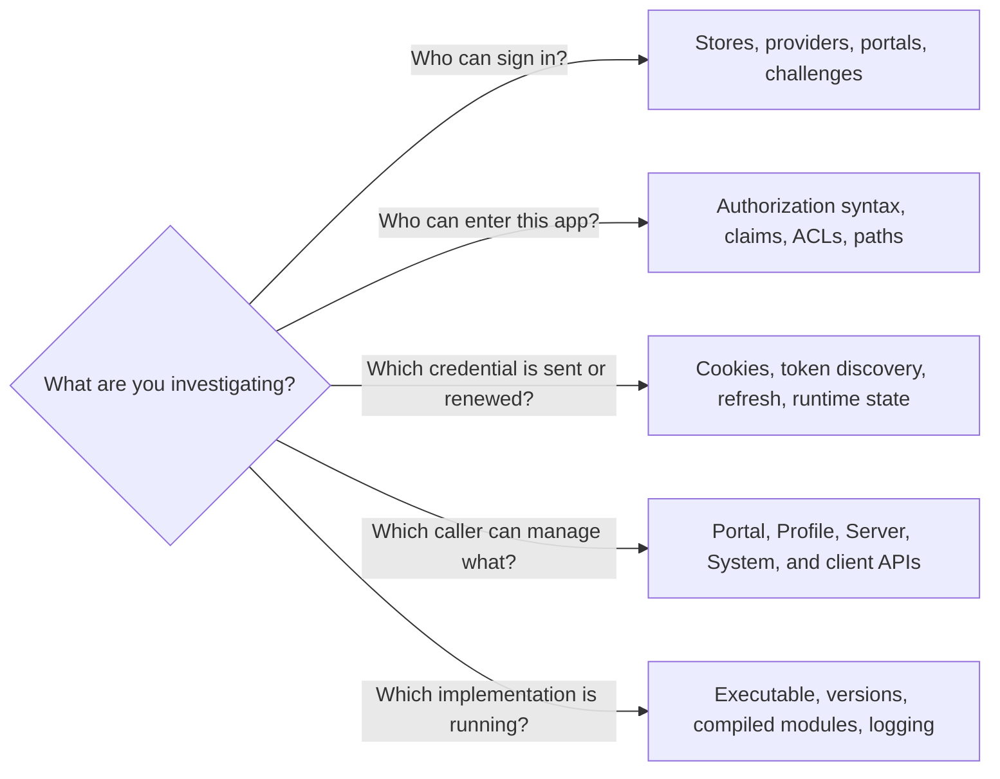

# Reference

Use these pages when you know which setting or interface you need. For a complete
working example, start with [Protect your first app](start/first-app.md).




## Caddyfile configuration

AuthCrunch's named stores, portals, and policies belong inside the global
`security` block. The `authenticate` and `authorize` handlers connect them to
routes in a site block.

| Area | Reference |
| --- | --- |
| Portal configuration | [First portal configuration](start/first-app.md#1-create-the-configuration) |
| Local identities | [Identity store](authenticate/local/20-identity-store.md) and [static users](authenticate/local/50-static-users.md) |
| OAuth / OIDC identity providers | [Provider settings](authenticate/oauth/81-backend-oauth2-0000-generic.md) and [endpoint configuration](authenticate/oauth/82-backend-oauth2-endpoint.md) |
| Upstream token trust | [Issuer/audience, static pins and JWKS rollover](authenticate/oauth/83-oidc-trust.md) |
| SAML login | [Browser-bound flow and pinned signing trust](authenticate/saml/10-saml.md) |
| Service credentials and delivery | [Secret references](credentials/intro.md) and [messaging limits](messaging/intro.md) |
| User mapping | [Transforms](authenticate/42-user-transforms.md) |
| Login requirements | [Authentication challenges](authenticate/13-authentication-challenges.md) |
| Policy syntax | [Authorization syntax](authorize/syntax.md) |
| Access rules | [Roles and claims](authorize/acl-rbac.md) and [paths](authorize/path-acl.md) |
| Request identity | [Headers](authorize/headers.md) and [placeholders](authorize/placeholders.md) |

For Caddy itself, use the official [Caddyfile concepts](https://caddyserver.com/docs/caddyfile/concepts)
and [`route` reference](https://caddyserver.com/docs/caddyfile/directives/route).
Handler order determines whether an access check runs before the application.

## Tokens and cookies

- [Cookie settings](authenticate/auth-cookie.md)
- [Token discovery](authorize/token-discovery.md)
- [Token verification](authorize/token-verification.md)
- [Generate an ECDSA key](authorize/encryption.md)
- [Logout](authenticate/15-logout.md)
- [Refresh sessions](authenticate/30-refresh-token.md)
- [Persistent runtime state](operations/runtime-state.md)

## Application sign-in models

- [Direct OAuth authorization](authorize/direct-oauth.md) for provider sign-in without a portal.
- [AuthCrunch as an OpenID Provider](apps/oidc-provider.md) for relying applications using local accounts.

Use [Applications and SSO](apps/intro.md) to distinguish these models from
upstream SAML login and the incomplete AWS SAML assertion flow.

## APIs

Begin with the [API overview](authenticate/api/10-api.md), then select the
interface that matches your caller:

- [Go authentication client](operations/authclient.md)
- [Profile API](authenticate/api/30-profile-api.md)
- [Portal API](authenticate/api/20-portal-api.md)
- [Server API](authenticate/api/40-server-api.md)
- [System API](authenticate/api/50-system-api.md)

API permissions and authentication requirements are endpoint-specific. A portal
login alone does not establish administrative API access.

## Management commands

Use the [bundled local management CLI](operations/local-client.md) to inspect
stores, administer accounts through an enabled Server API, and generate
credentials offline. Client YAML and server Caddyfile configuration are separate.

## Executable and versions

The bundled executable is named `authcrunch`; a custom Caddy build may be named
`caddy`. Use the actual executable path when running these commands:

```sh
./bin/authcrunch version
./bin/authcrunch security version
./bin/authcrunch list-modules
./bin/authcrunch security --help
```

`version` reports Caddy's version; `security version` reports the AuthCrunch
library version. The [installation guide](start/install.md) identifies the
bundle used in the learning path. Check the
[release notes](https://github.com/greenpau/caddy-security/releases) before
using configuration from a different version.

See [Feature availability and versions](operations/versions.md) for the
distinction between the released integration and newer library features, and
[Authentication logging](operations/logging.md) for diagnostic controls.

## Agentic Prompts

Copy a prompt into your LLM to explore this topic. Each prompt prioritizes
upstream repository guidance and code over this page, and asks for version-aware
reasoning.

<div className="agentic-prompts">

<details>
<summary>Choose the right reference family</summary>

```text
Help me understand Reference.

Primary authorities (take precedence over website documentation):
https://github.com/greenpau/caddy-security/blob/main/AGENTS.md
https://github.com/greenpau/caddy-security/tree/main/.codex/skills
https://github.com/greenpau/go-authcrunch/blob/main/AGENTS.md
https://github.com/greenpau/go-authcrunch/tree/main/.codex/skills
Read each repository's root AGENTS.md first, then any scoped AGENTS.md that
applies to inspected paths. Read the relevant SKILL.md files and follow their
implementation and test references.

Relevant skills to locate: configuration, configuration-authorization,
authentication-portal-api.

Secondary reference:
https://docs.authcrunch.com/docs/reference

If a source is inaccessible, ask me to paste its relevant text. Identify the
versions your answer applies to; main may be newer than my release. Resolve
disagreements using code and tests, and flag unverified claims. Use synthetic
credentials and redacted examples; explain proposed checks before any changes.

Ask me what I am trying to accomplish, who the caller is, and which executable
versions I run. Map the task to named stores/providers, a portal, an
authorization policy, an application protocol, or a specific API family.
Explain why similar names can describe different directions of trust.
```

</details>

<details>
<summary>Trace a setting through three layers</summary>

```text
Help me understand Reference.

Primary authorities (take precedence over website documentation):
https://github.com/greenpau/caddy-security/blob/main/AGENTS.md
https://github.com/greenpau/caddy-security/tree/main/.codex/skills
https://github.com/greenpau/go-authcrunch/blob/main/AGENTS.md
https://github.com/greenpau/go-authcrunch/tree/main/.codex/skills
Read each repository's root AGENTS.md first, then any scoped AGENTS.md that
applies to inspected paths. Read the relevant SKILL.md files and follow their
implementation and test references.

Relevant skills to locate: configuration, configuration-authorization,
authentication-portal-api.

Secondary reference:
https://docs.authcrunch.com/docs/reference

If a source is inaccessible, ask me to paste its relevant text. Identify the
versions your answer applies to; main may be newer than my release. Resolve
disagreements using code and tests, and flag unverified claims. Use synthetic
credentials and redacted examples; explain proposed checks before any changes.

Choose one directive and follow its Caddy adapter, library configuration
validation, runtime consumer, and focused tests. Explain what adaptation
proves, what provisioning proves, and what needs a live request. Compare my
installed tag with main before recommending the setting.
```

</details>

<details>
<summary>Read a complete configuration graph</summary>

```text
Help me understand Reference.

Primary authorities (take precedence over website documentation):
https://github.com/greenpau/caddy-security/blob/main/AGENTS.md
https://github.com/greenpau/caddy-security/tree/main/.codex/skills
https://github.com/greenpau/go-authcrunch/blob/main/AGENTS.md
https://github.com/greenpau/go-authcrunch/tree/main/.codex/skills
Read each repository's root AGENTS.md first, then any scoped AGENTS.md that
applies to inspected paths. Read the relevant SKILL.md files and follow their
implementation and test references.

Relevant skills to locate: configuration, configuration-authorization,
authentication-portal-api.

Secondary reference:
https://docs.authcrunch.com/docs/reference

If a source is inaccessible, ask me to paste its relevant text. Identify the
versions your answer applies to; main may be newer than my release. Resolve
disagreements using code and tests, and flag unverified claims. Use synthetic
credentials and redacted examples; explain proposed checks before any changes.

Annotate a synthetic global security block and its site routes. Trace
named-component references, authenticate/authorize handler mounting, and the
application handler order. Identify dangling names and a route that bypasses
the policy without treating a table of settings as a complete working example.
```

</details>

<details>
<summary>Match an API to its caller</summary>

```text
Help me understand Reference.

Primary authorities (take precedence over website documentation):
https://github.com/greenpau/caddy-security/blob/main/AGENTS.md
https://github.com/greenpau/caddy-security/tree/main/.codex/skills
https://github.com/greenpau/go-authcrunch/blob/main/AGENTS.md
https://github.com/greenpau/go-authcrunch/tree/main/.codex/skills
Read each repository's root AGENTS.md first, then any scoped AGENTS.md that
applies to inspected paths. Read the relevant SKILL.md files and follow their
implementation and test references.

Relevant skills to locate: configuration, configuration-authorization,
authentication-portal-api.

Secondary reference:
https://docs.authcrunch.com/docs/reference

If a source is inaccessible, ask me to paste its relevant text. Identify the
versions your answer applies to; main may be newer than my release. Resolve
disagreements using code and tests, and flag unverified claims. Use synthetic
credentials and redacted examples; explain proposed checks before any changes.

Compare browser identity probes, Profile operations, Server administration,
encrypted System authentication, the Go client, and downstream OIDC token
endpoints. Explain authentication transport, live-session requirements, and
independent admin/export switches. Do not carry a permission or credential
assumption from one API family to another.
```

</details>

<details>
<summary>Navigate a thematic investigation</summary>

```text
Help me understand Reference.

Primary authorities (take precedence over website documentation):
https://github.com/greenpau/caddy-security/blob/main/AGENTS.md
https://github.com/greenpau/caddy-security/tree/main/.codex/skills
https://github.com/greenpau/go-authcrunch/blob/main/AGENTS.md
https://github.com/greenpau/go-authcrunch/tree/main/.codex/skills
Read each repository's root AGENTS.md first, then any scoped AGENTS.md that
applies to inspected paths. Read the relevant SKILL.md files and follow their
implementation and test references.

Relevant skills to locate: configuration, configuration-authorization,
authentication-portal-api.

Secondary reference:
https://docs.authcrunch.com/docs/reference

If a source is inaccessible, ask me to paste its relevant text. Identify the
versions your answer applies to; main may be newer than my release. Resolve
disagreements using code and tests, and flag unverified claims. Use synthetic
credentials and redacted examples; explain proposed checks before any changes.

For an intermittent sign-in problem, guide me through versions,
callback/cookie scope, token discovery, verification, roles, current account
state, logging, and persistence. Ask for one redacted observable at a time.
Provide a short source-backed explanation and a teach-back question instead of
a list of unrelated configuration changes.
```

</details>

</div>

## Source Code References

Start with the code search, then follow the parser, runtime, and tests relevant
to this topic. These links target `main`; use GitHub's branch/tag selector to
compare them with your installed release.

1. [Search this topic in both repositories](https://github.com/search?q=%28repo%3Agreenpau%2Fgo-authcrunch%20OR%20repo%3Agreenpau%2Fcaddy-security%29%20%28Config%20OR%20NewServer%20OR%20parseCaddyfile%29&type=code)
   — searches topic-specific symbols and paths across both codebases.
2. [caddy-security: caddyfile.go](https://github.com/greenpau/caddy-security/blob/main/caddyfile.go)
   — registers global security configuration and route directive adapters.
3. [caddy-security: caddyfile_adapt_test.go](https://github.com/greenpau/caddy-security/blob/main/caddyfile_adapt_test.go)
   — checks complete Caddyfile fixtures against expected adapted configuration.
4. [go-authcrunch: config.go](https://github.com/greenpau/go-authcrunch/blob/main/config.go)
   — validates the library configuration graph and named components.
5. [go-authcrunch: server.go](https://github.com/greenpau/go-authcrunch/blob/main/server.go)
   — constructs the runtime and delegates named portal and policy requests.
6. [caddy-security: caddyfile_authn.go](https://github.com/greenpau/caddy-security/blob/main/caddyfile_authn.go)
   — dispatches authentication-portal configuration.
7. [caddy-security: caddyfile_authz.go](https://github.com/greenpau/caddy-security/blob/main/caddyfile_authz.go)
   — dispatches authorization-policy subdirectives into library configuration.
8. [go-authcrunch: pkg/authn/respond_api.go](https://github.com/greenpau/go-authcrunch/blob/main/pkg/authn/respond_api.go)
   — dispatches API routes and enforces admin enablement and role checks.
